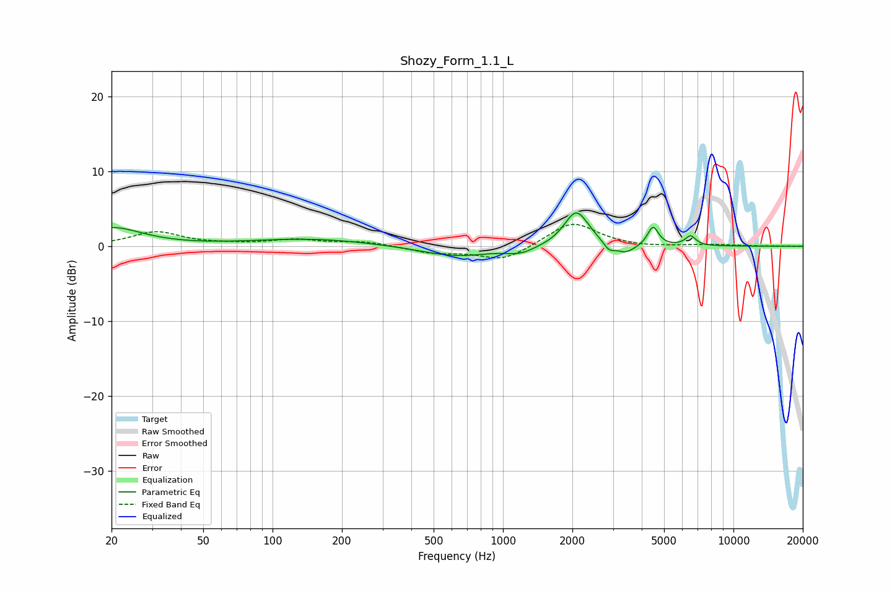

# Shozy_Form_1.1_L
See [usage instructions](https://github.com/jaakkopasanen/AutoEq#usage) for more options and info.

### Parametric EQs
Apply preamp of -4.5 dB when using parametric equalizer.

|   # | Type    |   Fc (Hz) |    Q |   Gain (dB) |
|-----|---------|-----------|------|-------------|
|   1 | Peaking |        20 | 1.08 |         2.4 |
|   2 | Peaking |       147 | 0.55 |         1   |
|   3 | Peaking |       626 | 0.92 |        -1.4 |
|   4 | Peaking |      1191 | 2.33 |        -0.8 |
|   5 | Peaking |      2071 | 2.75 |         4.3 |
|   6 | Peaking |      2203 | 2.39 |         0.6 |
|   7 | Peaking |      2884 | 5.99 |        -1   |
|   8 | Peaking |      3394 | 3.3  |        -1.2 |
|   9 | Peaking |      4478 | 6    |         2.6 |
|  10 | Peaking |      6513 | 6    |         1.3 |

### Fixed Band EQs
When using fixed band (also called graphic) equalizer, apply preamp of **-3.0 dB** (if available) and set gains manually with these parameters.

|   # | Type    |   Fc (Hz) |    Q |   Gain (dB) |
|-----|---------|-----------|------|-------------|
|   1 | Peaking |        31 | 1.41 |         1.9 |
|   2 | Peaking |        62 | 1.41 |         0.2 |
|   3 | Peaking |       125 | 1.41 |         0.8 |
|   4 | Peaking |       250 | 1.41 |         0.6 |
|   5 | Peaking |       500 | 1.41 |        -0.9 |
|   6 | Peaking |      1000 | 1.41 |        -2   |
|   7 | Peaking |      2000 | 1.41 |         3.3 |
|   8 | Peaking |      4000 | 1.41 |        -0.2 |
|   9 | Peaking |      8000 | 1.41 |         0.2 |
|  10 | Peaking |     16000 | 1.41 |         0   |

### Graphs

