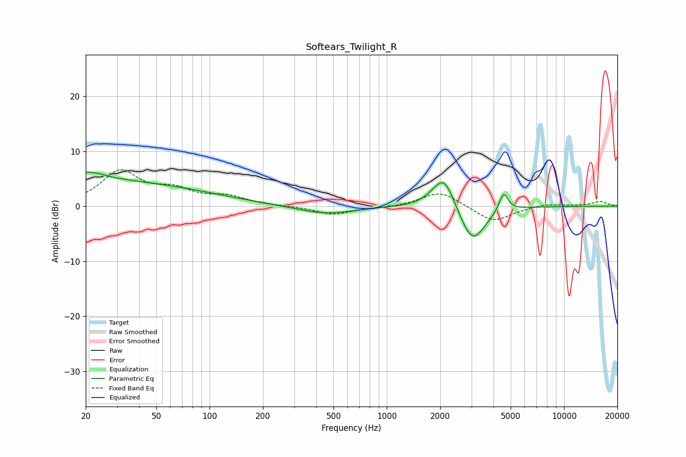

# Softears_Twilight_R
See [usage instructions](https://github.com/jaakkopasanen/AutoEq#usage) for more options and info.

### Parametric EQs
Apply preamp of -6.3 dB when using parametric equalizer.

|   # | Type    |   Fc (Hz) |    Q |   Gain (dB) |
|-----|---------|-----------|------|-------------|
|   1 | Peaking |        20 | 0.19 |         4.6 |
|   2 | Peaking |        20 | 1.46 |         1.6 |
|   3 | Peaking |        22 | 6    |        -2.9 |
|   4 | Peaking |        22 | 5.84 |         2.9 |
|   5 | Peaking |       450 | 0.89 |        -1.5 |
|   6 | Peaking |      1966 | 1.99 |         1.2 |
|   7 | Peaking |      2113 | 2.39 |         5.2 |
|   8 | Peaking |      3015 | 1.96 |        -5.3 |
|   9 | Peaking |      3116 | 2.12 |        -1.7 |
|  10 | Peaking |      4558 | 5.54 |         3.5 |

### Fixed Band EQs
When using fixed band (also called graphic) equalizer, apply preamp of **-6.7 dB** (if available) and set gains manually with these parameters.

|   # | Type    |   Fc (Hz) |    Q |   Gain (dB) |
|-----|---------|-----------|------|-------------|
|   1 | Peaking |        31 | 1.41 |         6.1 |
|   2 | Peaking |        62 | 1.41 |         2.4 |
|   3 | Peaking |       125 | 1.41 |         1.5 |
|   4 | Peaking |       250 | 1.41 |        -0   |
|   5 | Peaking |       500 | 1.41 |        -1.5 |
|   6 | Peaking |      1000 | 1.41 |        -0.3 |
|   7 | Peaking |      2000 | 1.41 |         2.8 |
|   8 | Peaking |      4000 | 1.41 |        -3   |
|   9 | Peaking |      8000 | 1.41 |         0.5 |
|  10 | Peaking |     16000 | 1.41 |         0.8 |

### Graphs

