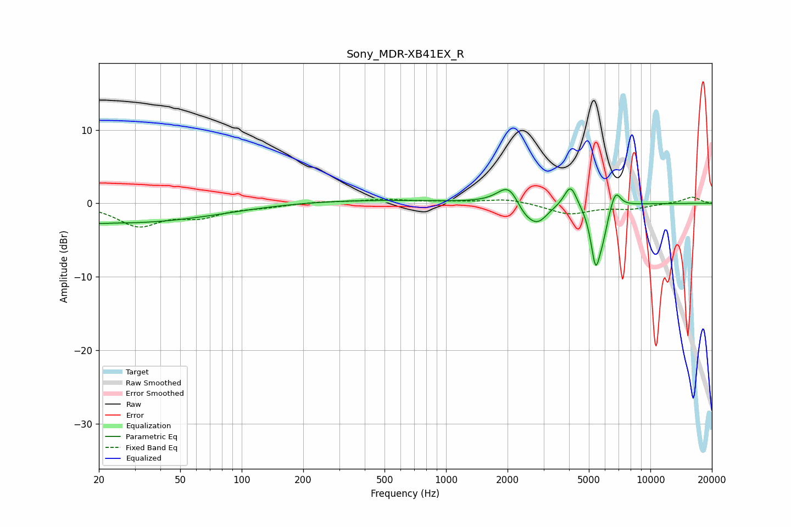

# Sony_MDR-XB41EX_R
See [usage instructions](https://github.com/jaakkopasanen/AutoEq#usage) for more options and info.

### Parametric EQs
Apply preamp of -2.1 dB when using parametric equalizer.

|   # | Type    |   Fc (Hz) |    Q |   Gain (dB) |
|-----|---------|-----------|------|-------------|
|   1 | Peaking |        20 | 5.36 |        -0.1 |
|   2 | Peaking |        25 | 0.29 |        -2.7 |
|   3 | Peaking |       380 | 0.33 |         0.5 |
|   4 | Peaking |      2033 | 2.6  |         2.9 |
|   5 | Peaking |      2414 | 2.97 |        -1.6 |
|   6 | Peaking |      2809 | 2.77 |        -2.5 |
|   7 | Peaking |      4066 | 4.6  |         3   |
|   8 | Peaking |      5395 | 5.71 |        -7.9 |
|   9 | Peaking |      5865 | 5.98 |        -2.4 |
|  10 | Peaking |      6755 | 5.62 |         2.4 |

### Fixed Band EQs
When using fixed band (also called graphic) equalizer, apply preamp of **-0.9 dB** (if available) and set gains manually with these parameters.

|   # | Type    |   Fc (Hz) |    Q |   Gain (dB) |
|-----|---------|-----------|------|-------------|
|   1 | Peaking |        31 | 1.41 |        -2.9 |
|   2 | Peaking |        62 | 1.41 |        -1.6 |
|   3 | Peaking |       125 | 1.41 |        -0.4 |
|   4 | Peaking |       250 | 1.41 |         0.2 |
|   5 | Peaking |       500 | 1.41 |         0.5 |
|   6 | Peaking |      1000 | 1.41 |         0.2 |
|   7 | Peaking |      2000 | 1.41 |         0.6 |
|   8 | Peaking |      4000 | 1.41 |        -1.5 |
|   9 | Peaking |      8000 | 1.41 |        -0.7 |
|  10 | Peaking |     16000 | 1.41 |         0.9 |

### Graphs

