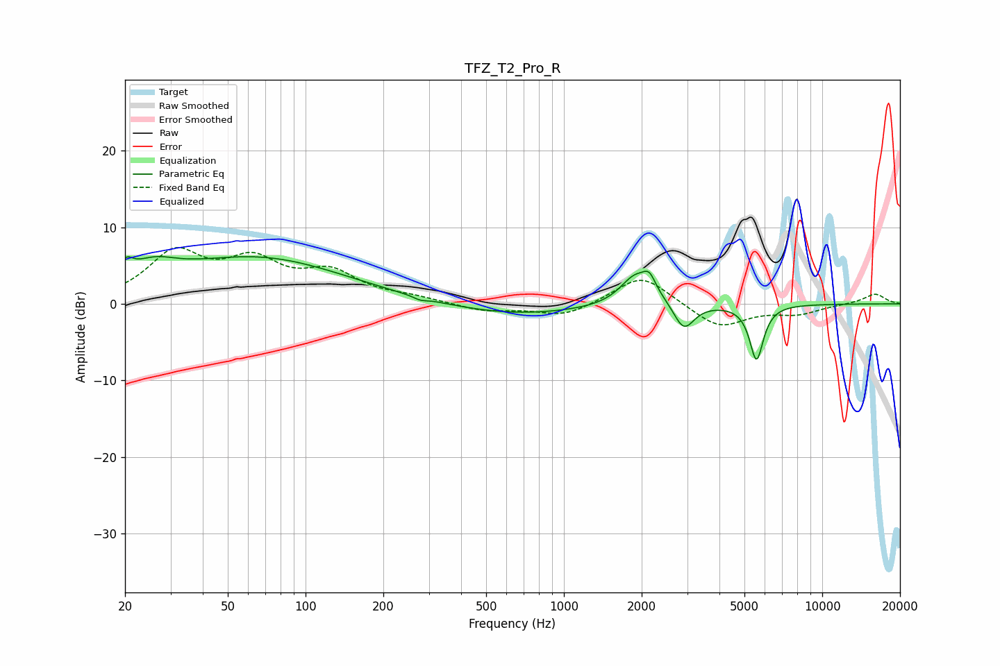

# TFZ_T2_Pro_R
See [usage instructions](https://github.com/jaakkopasanen/AutoEq#usage) for more options and info.

### Parametric EQs
Apply preamp of -6.3 dB when using parametric equalizer.

|   # | Type    |   Fc (Hz) |    Q |   Gain (dB) |
|-----|---------|-----------|------|-------------|
|   1 | Peaking |        20 | 5.79 |         1.9 |
|   2 | Peaking |        25 | 1.52 |         2.6 |
|   3 | Peaking |        65 | 0.41 |         6   |
|   4 | Peaking |       278 | 5.9  |        -0.4 |
|   5 | Peaking |       633 | 0.52 |        -1.5 |
|   6 | Peaking |      1892 | 2.39 |         3.8 |
|   7 | Peaking |      2141 | 5.97 |         1.9 |
|   8 | Peaking |      2326 | 2.01 |         0.5 |
|   9 | Peaking |      2911 | 3.53 |        -3.7 |
|  10 | Peaking |      5567 | 5.27 |        -7.2 |

### Fixed Band EQs
When using fixed band (also called graphic) equalizer, apply preamp of **-7.5 dB** (if available) and set gains manually with these parameters.

|   # | Type    |   Fc (Hz) |    Q |   Gain (dB) |
|-----|---------|-----------|------|-------------|
|   1 | Peaking |        31 | 1.41 |         6.3 |
|   2 | Peaking |        62 | 1.41 |         4.8 |
|   3 | Peaking |       125 | 1.41 |         3.6 |
|   4 | Peaking |       250 | 1.41 |         0.7 |
|   5 | Peaking |       500 | 1.41 |        -1   |
|   6 | Peaking |      1000 | 1.41 |        -1.7 |
|   7 | Peaking |      2000 | 1.41 |         4   |
|   8 | Peaking |      4000 | 1.41 |        -3.2 |
|   9 | Peaking |      8000 | 1.41 |        -1.2 |
|  10 | Peaking |     16000 | 1.41 |         1.3 |

### Graphs

