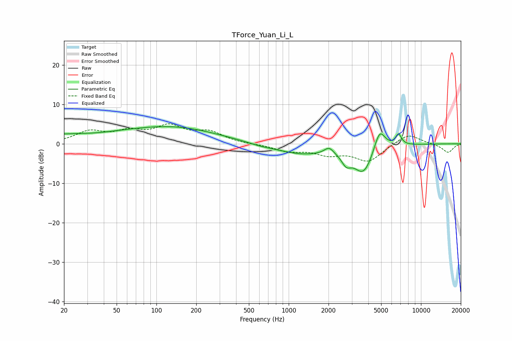

# TForce_Yuan_Li_L
See [usage instructions](https://github.com/jaakkopasanen/AutoEq#usage) for more options and info.

### Parametric EQs
Apply preamp of -4.4 dB when using parametric equalizer.

|   # | Type    |   Fc (Hz) |    Q |   Gain (dB) |
|-----|---------|-----------|------|-------------|
|   1 | Peaking |        34 | 0.78 |        -0.8 |
|   2 | Peaking |        57 | 0.18 |         3.5 |
|   3 | Peaking |       144 | 0.53 |         1.4 |
|   4 | Peaking |       610 | 1.54 |        -0.4 |
|   5 | Peaking |      1250 | 0.71 |        -2.5 |
|   6 | Peaking |      2019 | 4.04 |         1.8 |
|   7 | Peaking |      2721 | 4.03 |        -2.5 |
|   8 | Peaking |      3686 | 1.82 |        -7.3 |
|   9 | Peaking |      4862 | 3.21 |         5.9 |
|  10 | Peaking |      6764 | 5.99 |         2.8 |

### Fixed Band EQs
When using fixed band (also called graphic) equalizer, apply preamp of **-5.1 dB** (if available) and set gains manually with these parameters.

|   # | Type    |   Fc (Hz) |    Q |   Gain (dB) |
|-----|---------|-----------|------|-------------|
|   1 | Peaking |        31 | 1.41 |         2.9 |
|   2 | Peaking |        62 | 1.41 |         2.6 |
|   3 | Peaking |       125 | 1.41 |         4   |
|   4 | Peaking |       250 | 1.41 |         2.7 |
|   5 | Peaking |       500 | 1.41 |        -0.1 |
|   6 | Peaking |      1000 | 1.41 |        -1.7 |
|   7 | Peaking |      2000 | 1.41 |        -2.3 |
|   8 | Peaking |      4000 | 1.41 |        -4.3 |
|   9 | Peaking |      8000 | 1.41 |         2.7 |
|  10 | Peaking |     16000 | 1.41 |        -2.2 |

### Graphs

