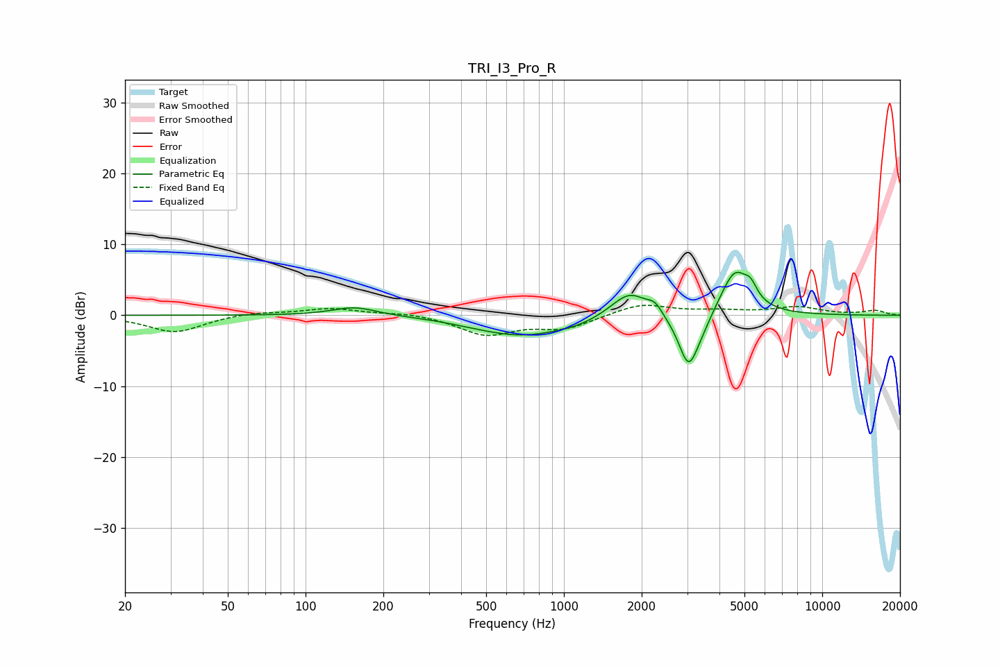

# TRI_I3_Pro_R
See [usage instructions](https://github.com/jaakkopasanen/AutoEq#usage) for more options and info.

### Parametric EQs
Apply preamp of -6.2 dB when using parametric equalizer.

|   # | Type    |   Fc (Hz) |    Q |   Gain (dB) |
|-----|---------|-----------|------|-------------|
|   1 | Peaking |       155 | 1.63 |         1.2 |
|   2 | Peaking |       459 | 1.25 |        -0.4 |
|   3 | Peaking |       698 | 0.87 |        -2.6 |
|   4 | Peaking |      1123 | 1.58 |        -0.6 |
|   5 | Peaking |      1795 | 1.97 |         3.7 |
|   6 | Peaking |      2250 | 5.04 |         1.3 |
|   7 | Peaking |      3035 | 3.55 |        -7.4 |
|   8 | Peaking |      3407 | 3.24 |        -1.3 |
|   9 | Peaking |      4591 | 2.46 |         6.5 |
|  10 | Peaking |      5288 | 5.95 |         1.7 |

### Fixed Band EQs
When using fixed band (also called graphic) equalizer, apply preamp of **-1.5 dB** (if available) and set gains manually with these parameters.

|   # | Type    |   Fc (Hz) |    Q |   Gain (dB) |
|-----|---------|-----------|------|-------------|
|   1 | Peaking |        31 | 1.41 |        -2.4 |
|   2 | Peaking |        62 | 1.41 |         0.5 |
|   3 | Peaking |       125 | 1.41 |         1   |
|   4 | Peaking |       250 | 1.41 |         0.4 |
|   5 | Peaking |       500 | 1.41 |        -2.7 |
|   6 | Peaking |      1000 | 1.41 |        -1.8 |
|   7 | Peaking |      2000 | 1.41 |         1.7 |
|   8 | Peaking |      4000 | 1.41 |         0.5 |
|   9 | Peaking |      8000 | 1.41 |         1.1 |
|  10 | Peaking |     16000 | 1.41 |         0.7 |

### Graphs

