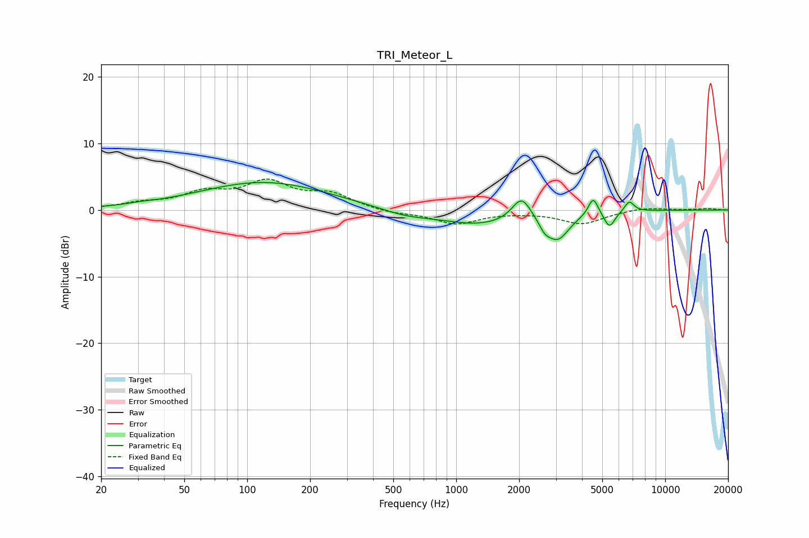

# TRI_Meteor_L
See [usage instructions](https://github.com/jaakkopasanen/AutoEq#usage) for more options and info.

### Parametric EQs
Apply preamp of -4.2 dB when using parametric equalizer.

|   # | Type    |   Fc (Hz) |    Q |   Gain (dB) |
|-----|---------|-----------|------|-------------|
|   1 | Peaking |        31 | 2.73 |         0.2 |
|   2 | Peaking |       120 | 0.45 |         4.2 |
|   3 | Peaking |       570 | 1.13 |        -0.9 |
|   4 | Peaking |      1295 | 0.75 |        -2.1 |
|   5 | Peaking |      2057 | 3.12 |         3.6 |
|   6 | Peaking |      2652 | 5.31 |        -1.2 |
|   7 | Peaking |      3057 | 2.58 |        -3.9 |
|   8 | Peaking |      4525 | 6    |         2.7 |
|   9 | Peaking |      5412 | 5.44 |        -2.4 |
|  10 | Peaking |      6730 | 6    |         1.6 |

### Fixed Band EQs
When using fixed band (also called graphic) equalizer, apply preamp of **-4.7 dB** (if available) and set gains manually with these parameters.

|   # | Type    |   Fc (Hz) |    Q |   Gain (dB) |
|-----|---------|-----------|------|-------------|
|   1 | Peaking |        31 | 1.41 |         0.8 |
|   2 | Peaking |        62 | 1.41 |         2.3 |
|   3 | Peaking |       125 | 1.41 |         3.8 |
|   4 | Peaking |       250 | 1.41 |         2.1 |
|   5 | Peaking |       500 | 1.41 |        -0.5 |
|   6 | Peaking |      1000 | 1.41 |        -2   |
|   7 | Peaking |      2000 | 1.41 |        -0.2 |
|   8 | Peaking |      4000 | 1.41 |        -2   |
|   9 | Peaking |      8000 | 1.41 |         0.4 |
|  10 | Peaking |     16000 | 1.41 |         0.2 |

### Graphs

