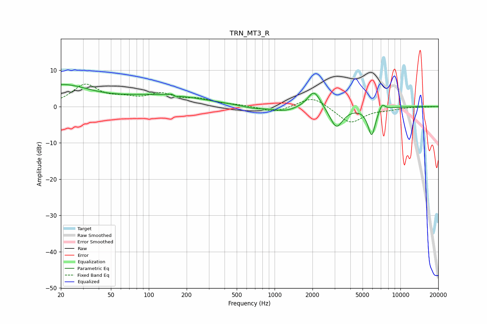

# TRN_MT3_R
See [usage instructions](https://github.com/jaakkopasanen/AutoEq#usage) for more options and info.

### Parametric EQs
Apply preamp of -6.2 dB when using parametric equalizer.

|   # | Type    |   Fc (Hz) |    Q |   Gain (dB) |
|-----|---------|-----------|------|-------------|
|   1 | Peaking |        20 | 0.62 |         5.7 |
|   2 | Peaking |       131 | 0.43 |         2.9 |
|   3 | Peaking |       158 | 5.62 |         2.5 |
|   4 | Peaking |       160 | 5.89 |        -2.5 |
|   5 | Peaking |       677 | 1.59 |        -0.7 |
|   6 | Peaking |      1208 | 1.44 |        -1.3 |
|   7 | Peaking |      2060 | 2.74 |         5   |
|   8 | Peaking |      3096 | 2.73 |        -5.9 |
|   9 | Peaking |      5908 | 4.57 |        -7.7 |
|  10 | Peaking |      7153 | 5.9  |         2   |

### Fixed Band EQs
When using fixed band (also called graphic) equalizer, apply preamp of **-6.3 dB** (if available) and set gains manually with these parameters.

|   # | Type    |   Fc (Hz) |    Q |   Gain (dB) |
|-----|---------|-----------|------|-------------|
|   1 | Peaking |        31 | 1.41 |         5.8 |
|   2 | Peaking |        62 | 1.41 |         1.6 |
|   3 | Peaking |       125 | 1.41 |         3   |
|   4 | Peaking |       250 | 1.41 |         1.7 |
|   5 | Peaking |       500 | 1.41 |         0.4 |
|   6 | Peaking |      1000 | 1.41 |        -1.7 |
|   7 | Peaking |      2000 | 1.41 |         3   |
|   8 | Peaking |      4000 | 1.41 |        -4.6 |
|   9 | Peaking |      8000 | 1.41 |        -0.6 |
|  10 | Peaking |     16000 | 1.41 |        -0.1 |

### Graphs

