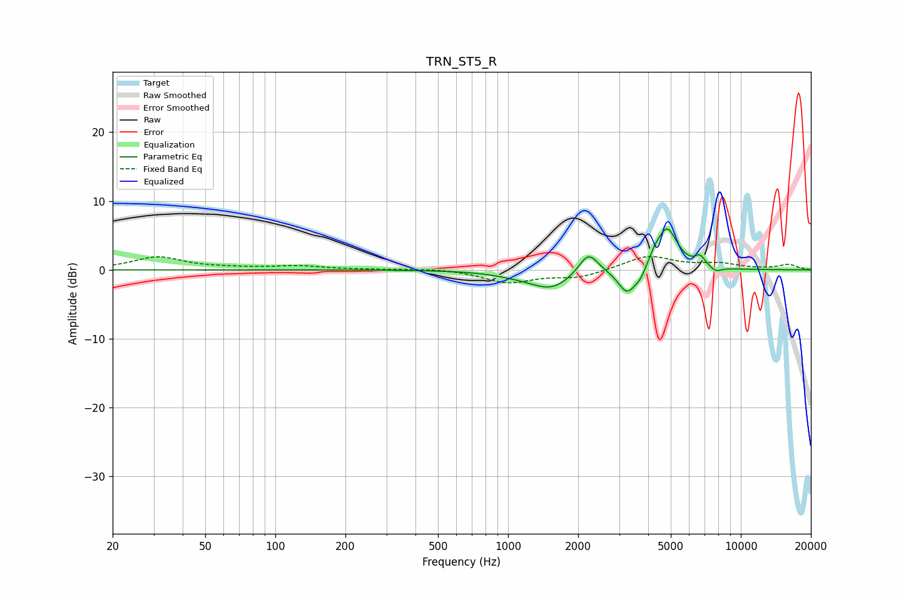

# TRN_ST5_R
See [usage instructions](https://github.com/jaakkopasanen/AutoEq#usage) for more options and info.

### Parametric EQs
Apply preamp of -6.0 dB when using parametric equalizer.

|   # | Type    |   Fc (Hz) |    Q |   Gain (dB) |
|-----|---------|-----------|------|-------------|
|   1 | Peaking |      1099 | 1.34 |        -0.5 |
|   2 | Peaking |      1538 | 1.6  |        -2.6 |
|   3 | Peaking |      2215 | 3.39 |         3.2 |
|   4 | Peaking |      3250 | 3.64 |        -3.7 |
|   5 | Peaking |      3697 | 5.99 |        -1.1 |
|   6 | Peaking |      4265 | 6    |         1   |
|   7 | Peaking |      4725 | 5.19 |         0.4 |
|   8 | Peaking |      4839 | 3.1  |         5.7 |
|   9 | Peaking |      6679 | 6    |         1.4 |
|  10 | Peaking |      7814 | 5.44 |        -0.7 |

### Fixed Band EQs
When using fixed band (also called graphic) equalizer, apply preamp of **-2.0 dB** (if available) and set gains manually with these parameters.

|   # | Type    |   Fc (Hz) |    Q |   Gain (dB) |
|-----|---------|-----------|------|-------------|
|   1 | Peaking |        31 | 1.41 |         1.8 |
|   2 | Peaking |        62 | 1.41 |         0.2 |
|   3 | Peaking |       125 | 1.41 |         0.5 |
|   4 | Peaking |       250 | 1.41 |         0   |
|   5 | Peaking |       500 | 1.41 |         0.2 |
|   6 | Peaking |      1000 | 1.41 |        -1.8 |
|   7 | Peaking |      2000 | 1.41 |        -1.1 |
|   8 | Peaking |      4000 | 1.41 |         2   |
|   9 | Peaking |      8000 | 1.41 |         0.8 |
|  10 | Peaking |     16000 | 1.41 |         0.7 |

### Graphs

