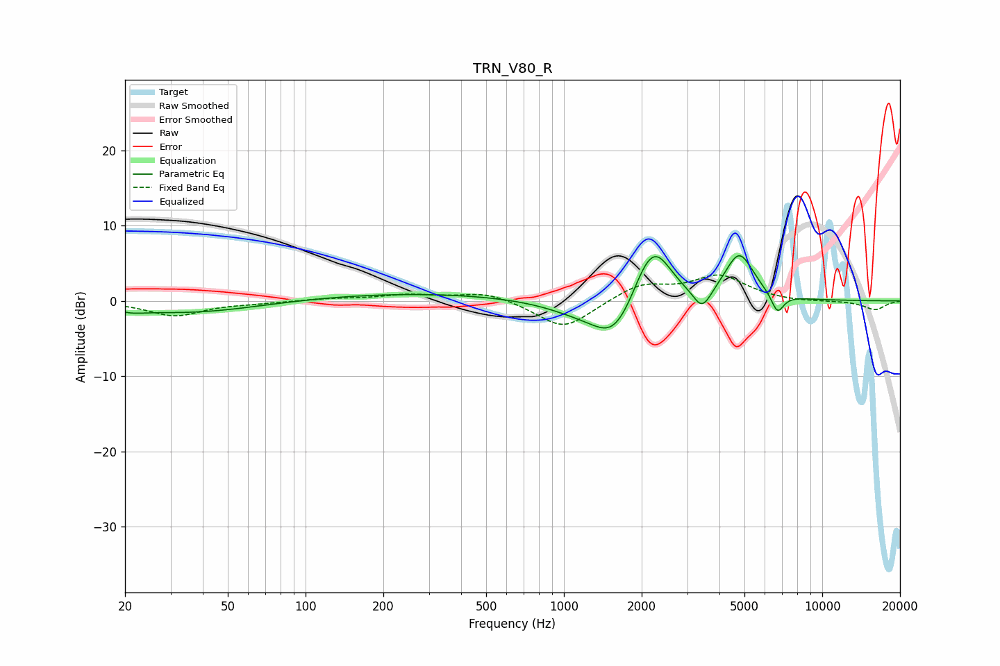

# TRN_V80_R
See [usage instructions](https://github.com/jaakkopasanen/AutoEq#usage) for more options and info.

### Parametric EQs
Apply preamp of -6.1 dB when using parametric equalizer.

|   # | Type    |   Fc (Hz) |    Q |   Gain (dB) |
|-----|---------|-----------|------|-------------|
|   1 | Peaking |        21 | 2.8  |        -0.4 |
|   2 | Peaking |        35 | 0.52 |        -1.6 |
|   3 | Peaking |       257 | 0.32 |         1   |
|   4 | Peaking |      1153 | 1.02 |        -1.4 |
|   5 | Peaking |      1559 | 1.7  |        -4.8 |
|   6 | Peaking |      2042 | 2.69 |         2.3 |
|   7 | Peaking |      2279 | 2.14 |         6.1 |
|   8 | Peaking |      3431 | 3.95 |        -3   |
|   9 | Peaking |      4773 | 2.47 |         6.2 |
|  10 | Peaking |      6711 | 5.64 |        -2.6 |

### Fixed Band EQs
When using fixed band (also called graphic) equalizer, apply preamp of **-3.5 dB** (if available) and set gains manually with these parameters.

|   # | Type    |   Fc (Hz) |    Q |   Gain (dB) |
|-----|---------|-----------|------|-------------|
|   1 | Peaking |        31 | 1.41 |        -2   |
|   2 | Peaking |        62 | 1.41 |        -0.2 |
|   3 | Peaking |       125 | 1.41 |         0.3 |
|   4 | Peaking |       250 | 1.41 |         0.8 |
|   5 | Peaking |       500 | 1.41 |         1.2 |
|   6 | Peaking |      1000 | 1.41 |        -3.9 |
|   7 | Peaking |      2000 | 1.41 |         2.2 |
|   8 | Peaking |      4000 | 1.41 |         3.2 |
|   9 | Peaking |      8000 | 1.41 |        -0.2 |
|  10 | Peaking |     16000 | 1.41 |        -1.2 |

### Graphs

