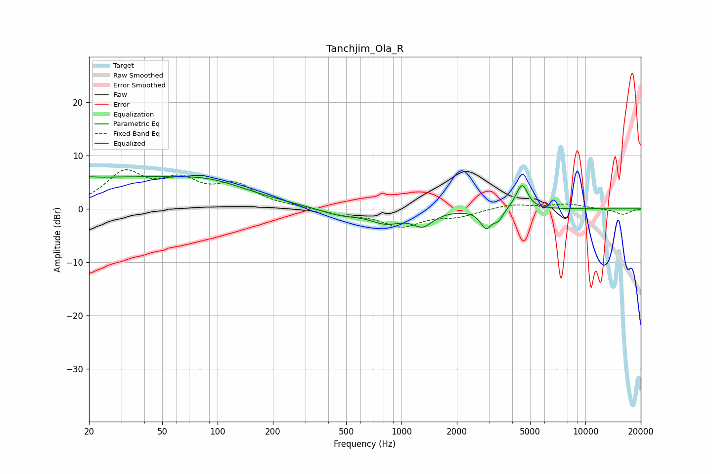

# Tanchjim_Ola_R
See [usage instructions](https://github.com/jaakkopasanen/AutoEq#usage) for more options and info.

### Parametric EQs
Apply preamp of -6.1 dB when using parametric equalizer.

|   # | Type    |   Fc (Hz) |    Q |   Gain (dB) |
|-----|---------|-----------|------|-------------|
|   1 | Peaking |        20 | 5.94 |         0.2 |
|   2 | Peaking |        25 | 0.18 |         5.7 |
|   3 | Peaking |        92 | 0.8  |         1.5 |
|   4 | Peaking |       460 | 1.23 |        -1.3 |
|   5 | Peaking |       825 | 1.59 |        -2.3 |
|   6 | Peaking |      1306 | 2.61 |        -2.6 |
|   7 | Peaking |      2881 | 4.67 |        -3.3 |
|   8 | Peaking |      3362 | 5.55 |        -1.7 |
|   9 | Peaking |      4427 | 4.1  |         2.3 |
|  10 | Peaking |      4582 | 5.02 |         2.6 |

### Fixed Band EQs
When using fixed band (also called graphic) equalizer, apply preamp of **-7.4 dB** (if available) and set gains manually with these parameters.

|   # | Type    |   Fc (Hz) |    Q |   Gain (dB) |
|-----|---------|-----------|------|-------------|
|   1 | Peaking |        31 | 1.41 |         6.4 |
|   2 | Peaking |        62 | 1.41 |         4.4 |
|   3 | Peaking |       125 | 1.41 |         4   |
|   4 | Peaking |       250 | 1.41 |         0.3 |
|   5 | Peaking |       500 | 1.41 |        -1   |
|   6 | Peaking |      1000 | 1.41 |        -3.1 |
|   7 | Peaking |      2000 | 1.41 |        -1.2 |
|   8 | Peaking |      4000 | 1.41 |         0.9 |
|   9 | Peaking |      8000 | 1.41 |         0.9 |
|  10 | Peaking |     16000 | 1.41 |        -1.1 |

### Graphs

