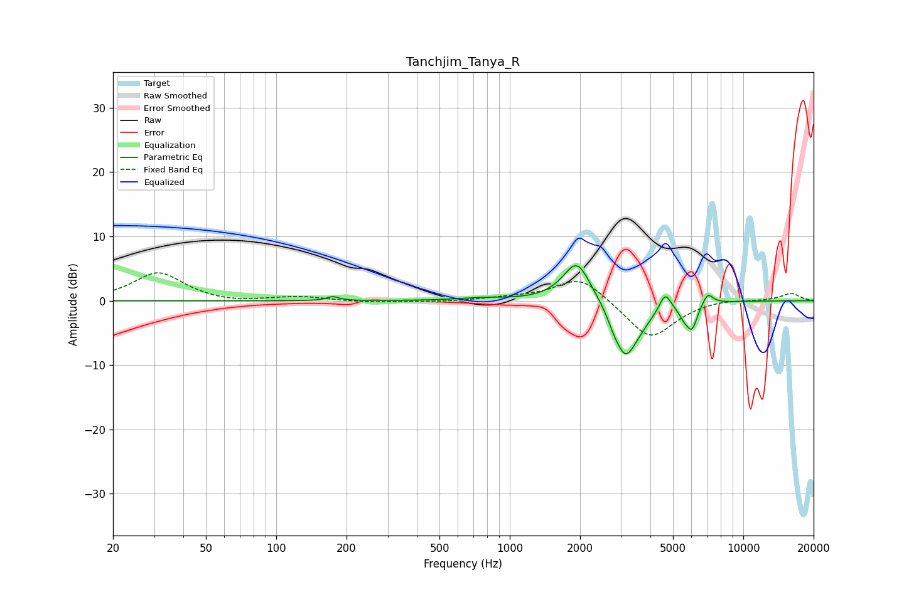

# Tanchjim_Tanya_R
See [usage instructions](https://github.com/jaakkopasanen/AutoEq#usage) for more options and info.

### Parametric EQs
Apply preamp of -5.5 dB when using parametric equalizer.

|   # | Type    |   Fc (Hz) |    Q |   Gain (dB) |
|-----|---------|-----------|------|-------------|
|   1 | Peaking |       175 | 5.62 |         0.6 |
|   2 | Peaking |       759 | 1.43 |         0.4 |
|   3 | Peaking |      1940 | 2.35 |         6.5 |
|   4 | Peaking |      2775 | 6    |        -0.8 |
|   5 | Peaking |      3117 | 2.84 |        -7.9 |
|   6 | Peaking |      3605 | 2.38 |        -1.7 |
|   7 | Peaking |      4626 | 5.99 |         2.7 |
|   8 | Peaking |      5566 | 6    |        -1.3 |
|   9 | Peaking |      6025 | 5.76 |        -3.8 |
|  10 | Peaking |      7041 | 6    |         1.8 |

### Fixed Band EQs
When using fixed band (also called graphic) equalizer, apply preamp of **-4.4 dB** (if available) and set gains manually with these parameters.

|   # | Type    |   Fc (Hz) |    Q |   Gain (dB) |
|-----|---------|-----------|------|-------------|
|   1 | Peaking |        31 | 1.41 |         4.4 |
|   2 | Peaking |        62 | 1.41 |        -0.4 |
|   3 | Peaking |       125 | 1.41 |         0.6 |
|   4 | Peaking |       250 | 1.41 |        -0.3 |
|   5 | Peaking |       500 | 1.41 |        -0.2 |
|   6 | Peaking |      1000 | 1.41 |         0.4 |
|   7 | Peaking |      2000 | 1.41 |         4   |
|   8 | Peaking |      4000 | 1.41 |        -6.1 |
|   9 | Peaking |      8000 | 1.41 |         0.4 |
|  10 | Peaking |     16000 | 1.41 |         1.2 |

### Graphs

