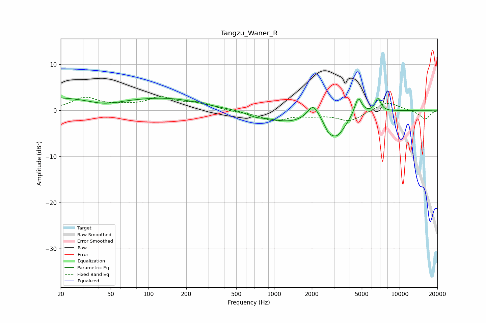

# Tangzu_Waner_R
See [usage instructions](https://github.com/jaakkopasanen/AutoEq#usage) for more options and info.

### Parametric EQs
Apply preamp of -2.8 dB when using parametric equalizer.

|   # | Type    |   Fc (Hz) |    Q |   Gain (dB) |
|-----|---------|-----------|------|-------------|
|   1 | Peaking |        20 | 0.25 |         2.9 |
|   2 | Peaking |        44 | 0.99 |        -1.4 |
|   3 | Peaking |       152 | 0.54 |         2   |
|   4 | Peaking |       714 | 2.23 |        -0.7 |
|   5 | Peaking |      1287 | 0.82 |        -2.3 |
|   6 | Peaking |      2053 | 3.1  |         3.4 |
|   7 | Peaking |      2716 | 5.99 |        -0.9 |
|   8 | Peaking |      3121 | 1.9  |        -5.4 |
|   9 | Peaking |      4682 | 4.88 |         3.9 |
|  10 | Peaking |      6729 | 6    |         2.8 |

### Fixed Band EQs
When using fixed band (also called graphic) equalizer, apply preamp of **-3.1 dB** (if available) and set gains manually with these parameters.

|   # | Type    |   Fc (Hz) |    Q |   Gain (dB) |
|-----|---------|-----------|------|-------------|
|   1 | Peaking |        31 | 1.41 |         2.6 |
|   2 | Peaking |        62 | 1.41 |         0.7 |
|   3 | Peaking |       125 | 1.41 |         2.5 |
|   4 | Peaking |       250 | 1.41 |         1.5 |
|   5 | Peaking |       500 | 1.41 |        -0.3 |
|   6 | Peaking |      1000 | 1.41 |        -2.1 |
|   7 | Peaking |      2000 | 1.41 |        -0.8 |
|   8 | Peaking |      4000 | 1.41 |        -2.3 |
|   9 | Peaking |      8000 | 1.41 |         2   |
|  10 | Peaking |     16000 | 1.41 |        -1.9 |

### Graphs

