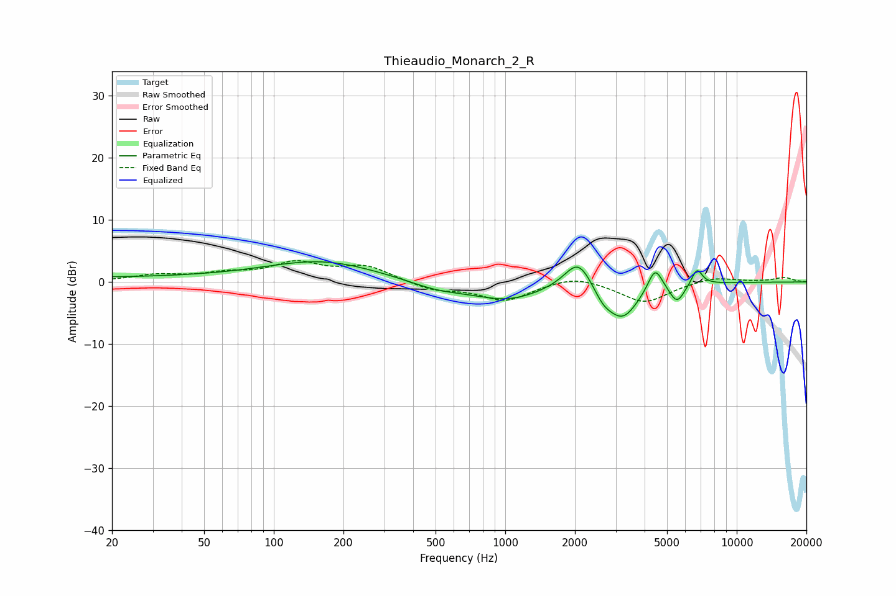

# Thieaudio_Monarch_2_R
See [usage instructions](https://github.com/jaakkopasanen/AutoEq#usage) for more options and info.

### Parametric EQs
Apply preamp of -3.4 dB when using parametric equalizer.

|   # | Type    |   Fc (Hz) |    Q |   Gain (dB) |
|-----|---------|-----------|------|-------------|
|   1 | Peaking |        27 | 0.18 |         0.7 |
|   2 | Peaking |       164 | 0.59 |         3.1 |
|   3 | Peaking |       512 | 1.1  |        -1.3 |
|   4 | Peaking |      1023 | 0.95 |        -2.7 |
|   5 | Peaking |      2071 | 2.36 |         4.9 |
|   6 | Peaking |      2651 | 3.35 |        -1.9 |
|   7 | Peaking |      3216 | 2.03 |        -5.6 |
|   8 | Peaking |      4441 | 4.51 |         3.9 |
|   9 | Peaking |      5520 | 4.23 |        -3   |
|  10 | Peaking |      6732 | 5.87 |         2.7 |

### Fixed Band EQs
When using fixed band (also called graphic) equalizer, apply preamp of **-3.5 dB** (if available) and set gains manually with these parameters.

|   # | Type    |   Fc (Hz) |    Q |   Gain (dB) |
|-----|---------|-----------|------|-------------|
|   1 | Peaking |        31 | 1.41 |         1   |
|   2 | Peaking |        62 | 1.41 |         1.1 |
|   3 | Peaking |       125 | 1.41 |         2.8 |
|   4 | Peaking |       250 | 1.41 |         2.4 |
|   5 | Peaking |       500 | 1.41 |        -1.3 |
|   6 | Peaking |      1000 | 1.41 |        -2.9 |
|   7 | Peaking |      2000 | 1.41 |         1.2 |
|   8 | Peaking |      4000 | 1.41 |        -3.3 |
|   9 | Peaking |      8000 | 1.41 |         0.9 |
|  10 | Peaking |     16000 | 1.41 |         0.7 |

### Graphs

