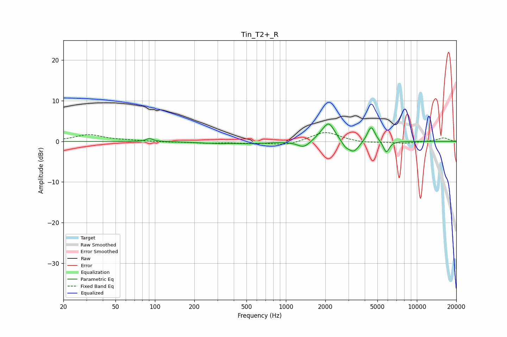

# Tin_T2+_R
See [usage instructions](https://github.com/jaakkopasanen/AutoEq#usage) for more options and info.

### Parametric EQs
Apply preamp of -4.4 dB when using parametric equalizer.

|   # | Type    |   Fc (Hz) |    Q |   Gain (dB) |
|-----|---------|-----------|------|-------------|
|   1 | Peaking |        91 | 5.35 |         0.7 |
|   2 | Peaking |       282 | 1.1  |        -0.4 |
|   3 | Peaking |       555 | 1.29 |        -0.5 |
|   4 | Peaking |      1370 | 2.93 |        -1.7 |
|   5 | Peaking |      1884 | 2.69 |         0.9 |
|   6 | Peaking |      2133 | 3.18 |         4.2 |
|   7 | Peaking |      2841 | 5.27 |        -1   |
|   8 | Peaking |      3283 | 3.23 |        -2.9 |
|   9 | Peaking |      4475 | 4.82 |         4   |
|  10 | Peaking |      5846 | 6    |        -2.9 |

### Fixed Band EQs
When using fixed band (also called graphic) equalizer, apply preamp of **-2.3 dB** (if available) and set gains manually with these parameters.

|   # | Type    |   Fc (Hz) |    Q |   Gain (dB) |
|-----|---------|-----------|------|-------------|
|   1 | Peaking |        31 | 1.41 |         1.6 |
|   2 | Peaking |        62 | 1.41 |         0.2 |
|   3 | Peaking |       125 | 1.41 |        -0.2 |
|   4 | Peaking |       250 | 1.41 |        -0.4 |
|   5 | Peaking |       500 | 1.41 |        -0.3 |
|   6 | Peaking |      1000 | 1.41 |        -1   |
|   7 | Peaking |      2000 | 1.41 |         2.4 |
|   8 | Peaking |      4000 | 1.41 |        -0.4 |
|   9 | Peaking |      8000 | 1.41 |        -0.5 |
|  10 | Peaking |     16000 | 1.41 |         0.9 |

### Graphs

