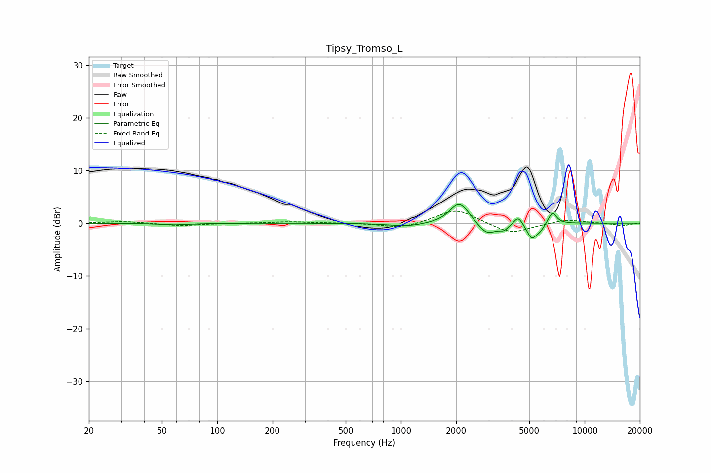

# Tipsy_Tromso_L
See [usage instructions](https://github.com/jaakkopasanen/AutoEq#usage) for more options and info.

### Parametric EQs
Apply preamp of -3.6 dB when using parametric equalizer.

|   # | Type    |   Fc (Hz) |    Q |   Gain (dB) |
|-----|---------|-----------|------|-------------|
|   1 | Peaking |        58 | 1.69 |        -0.3 |
|   2 | Peaking |      1074 | 1.45 |        -0.6 |
|   3 | Peaking |      2058 | 2.86 |         3.4 |
|   4 | Peaking |      2262 | 2.32 |         1   |
|   5 | Peaking |      2928 | 2.63 |        -2.5 |
|   6 | Peaking |      3632 | 5.87 |        -0.9 |
|   7 | Peaking |      4349 | 6    |         1.8 |
|   8 | Peaking |      5156 | 5.43 |        -2.8 |
|   9 | Peaking |      5727 | 6    |        -1.1 |
|  10 | Peaking |      6679 | 6    |         2.3 |

### Fixed Band EQs
When using fixed band (also called graphic) equalizer, apply preamp of **-2.4 dB** (if available) and set gains manually with these parameters.

|   # | Type    |   Fc (Hz) |    Q |   Gain (dB) |
|-----|---------|-----------|------|-------------|
|   1 | Peaking |        31 | 1.41 |         0.4 |
|   2 | Peaking |        62 | 1.41 |        -0.5 |
|   3 | Peaking |       125 | 1.41 |        -0   |
|   4 | Peaking |       250 | 1.41 |         0.3 |
|   5 | Peaking |       500 | 1.41 |         0.1 |
|   6 | Peaking |      1000 | 1.41 |        -1   |
|   7 | Peaking |      2000 | 1.41 |         2.8 |
|   8 | Peaking |      4000 | 1.41 |        -2.1 |
|   9 | Peaking |      8000 | 1.41 |         0.7 |
|  10 | Peaking |     16000 | 1.41 |        -0.5 |

### Graphs

