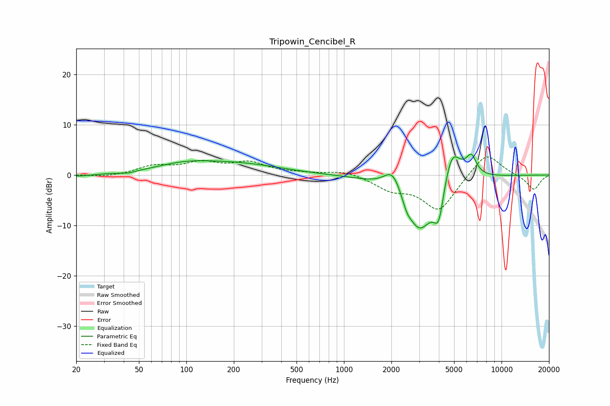

# Tripowin_Cencibel_R
See [usage instructions](https://github.com/jaakkopasanen/AutoEq#usage) for more options and info.

### Parametric EQs
Apply preamp of -4.3 dB when using parametric equalizer.

|   # | Type    |   Fc (Hz) |    Q |   Gain (dB) |
|-----|---------|-----------|------|-------------|
|   1 | Peaking |        21 | 1.69 |        -0.4 |
|   2 | Peaking |        43 | 3.06 |        -0.4 |
|   3 | Peaking |        96 | 0.76 |         1.6 |
|   4 | Peaking |       217 | 0.52 |         2   |
|   5 | Peaking |      2047 | 2.42 |         4.9 |
|   6 | Peaking |      2504 | 5.52 |        -1.4 |
|   7 | Peaking |      3007 | 1.36 |       -11.7 |
|   8 | Peaking |      3996 | 4.26 |        -6.9 |
|   9 | Peaking |      4824 | 2.34 |         8.3 |
|  10 | Peaking |      6428 | 4.22 |         3.7 |

### Fixed Band EQs
When using fixed band (also called graphic) equalizer, apply preamp of **-3.7 dB** (if available) and set gains manually with these parameters.

|   # | Type    |   Fc (Hz) |    Q |   Gain (dB) |
|-----|---------|-----------|------|-------------|
|   1 | Peaking |        31 | 1.41 |        -0.4 |
|   2 | Peaking |        62 | 1.41 |         1.7 |
|   3 | Peaking |       125 | 1.41 |         2.2 |
|   4 | Peaking |       250 | 1.41 |         2.3 |
|   5 | Peaking |       500 | 1.41 |         0.3 |
|   6 | Peaking |      1000 | 1.41 |         0.9 |
|   7 | Peaking |      2000 | 1.41 |        -2.5 |
|   8 | Peaking |      4000 | 1.41 |        -7   |
|   9 | Peaking |      8000 | 1.41 |         4.8 |
|  10 | Peaking |     16000 | 1.41 |        -3   |

### Graphs

