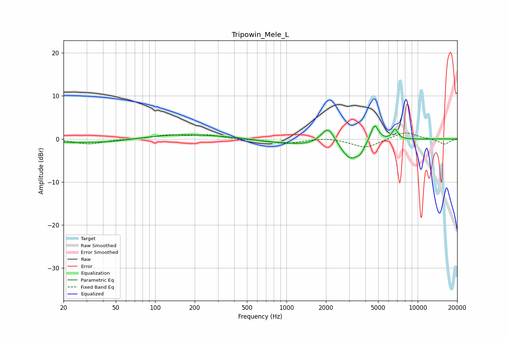

# Tripowin_Mele_L
See [usage instructions](https://github.com/jaakkopasanen/AutoEq#usage) for more options and info.

### Parametric EQs
Apply preamp of -3.1 dB when using parametric equalizer.

|   # | Type    |   Fc (Hz) |    Q |   Gain (dB) |
|-----|---------|-----------|------|-------------|
|   1 | Peaking |        22 | 1.54 |        -0.3 |
|   2 | Peaking |        41 | 0.55 |        -1   |
|   3 | Peaking |       149 | 0.42 |         1.2 |
|   4 | Peaking |       730 | 1.3  |        -0.5 |
|   5 | Peaking |      1367 | 1.08 |        -1.1 |
|   6 | Peaking |      2081 | 2.68 |         4.1 |
|   7 | Peaking |      3082 | 1.8  |        -5   |
|   8 | Peaking |      3653 | 5.72 |        -1   |
|   9 | Peaking |      4682 | 4.48 |         4.2 |
|  10 | Peaking |      6724 | 6    |         2.3 |

### Fixed Band EQs
When using fixed band (also called graphic) equalizer, apply preamp of **-1.5 dB** (if available) and set gains manually with these parameters.

|   # | Type    |   Fc (Hz) |    Q |   Gain (dB) |
|-----|---------|-----------|------|-------------|
|   1 | Peaking |        31 | 1.41 |        -1.2 |
|   2 | Peaking |        62 | 1.41 |        -0   |
|   3 | Peaking |       125 | 1.41 |         0.9 |
|   4 | Peaking |       250 | 1.41 |         0.9 |
|   5 | Peaking |       500 | 1.41 |        -0.2 |
|   6 | Peaking |      1000 | 1.41 |        -1   |
|   7 | Peaking |      2000 | 1.41 |         0.4 |
|   8 | Peaking |      4000 | 1.41 |        -2.1 |
|   9 | Peaking |      8000 | 1.41 |         1.7 |
|  10 | Peaking |     16000 | 1.41 |        -1.3 |

### Graphs

