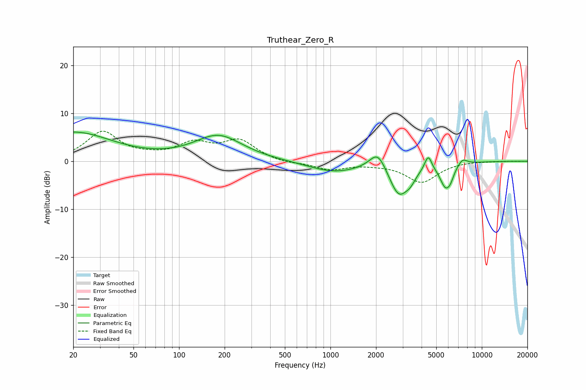

# Truthear_Zero_R
See [usage instructions](https://github.com/jaakkopasanen/AutoEq#usage) for more options and info.

### Parametric EQs
Apply preamp of -6.2 dB when using parametric equalizer.

|   # | Type    |   Fc (Hz) |    Q |   Gain (dB) |
|-----|---------|-----------|------|-------------|
|   1 | Peaking |        20 | 0.55 |         6   |
|   2 | Peaking |       182 | 0.89 |         5.2 |
|   3 | Peaking |      1056 | 0.84 |        -2.2 |
|   4 | Peaking |      2059 | 2.57 |         4.1 |
|   5 | Peaking |      2835 | 2.1  |        -7   |
|   6 | Peaking |      3379 | 4.45 |        -1.3 |
|   7 | Peaking |      4424 | 6    |         3.2 |
|   8 | Peaking |      5754 | 3.74 |        -4.6 |
|   9 | Peaking |      6217 | 6    |        -1.4 |
|  10 | Peaking |      7456 | 4.46 |         1.3 |

### Fixed Band EQs
When using fixed band (also called graphic) equalizer, apply preamp of **-6.3 dB** (if available) and set gains manually with these parameters.

|   # | Type    |   Fc (Hz) |    Q |   Gain (dB) |
|-----|---------|-----------|------|-------------|
|   1 | Peaking |        31 | 1.41 |         6   |
|   2 | Peaking |        62 | 1.41 |         0.6 |
|   3 | Peaking |       125 | 1.41 |         3.4 |
|   4 | Peaking |       250 | 1.41 |         4.1 |
|   5 | Peaking |       500 | 1.41 |        -0.5 |
|   6 | Peaking |      1000 | 1.41 |        -1.7 |
|   7 | Peaking |      2000 | 1.41 |        -0.4 |
|   8 | Peaking |      4000 | 1.41 |        -4.3 |
|   9 | Peaking |      8000 | 1.41 |         0.1 |
|  10 | Peaking |     16000 | 1.41 |         0   |

### Graphs

