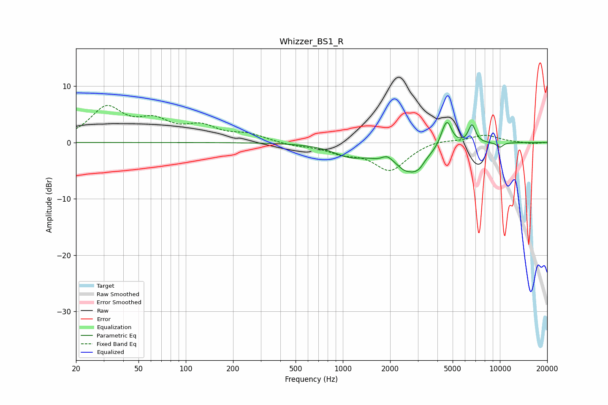

# Whizzer_BS1_R
See [usage instructions](https://github.com/jaakkopasanen/AutoEq#usage) for more options and info.

### Parametric EQs
Apply preamp of -3.6 dB when using parametric equalizer.

|   # | Type    |   Fc (Hz) |    Q |   Gain (dB) |
|-----|---------|-----------|------|-------------|
|   1 | Peaking |      1122 | 1.28 |        -2.2 |
|   2 | Peaking |      1660 | 2.58 |        -0.7 |
|   3 | Peaking |      1915 | 4.41 |         0.8 |
|   4 | Peaking |      2652 | 6    |         0.3 |
|   5 | Peaking |      2688 | 1.64 |        -5.3 |
|   6 | Peaking |      3083 | 6    |        -0.5 |
|   7 | Peaking |      4320 | 6    |         0.7 |
|   8 | Peaking |      4613 | 4.6  |         4.2 |
|   9 | Peaking |      6640 | 5.88 |         3.3 |
|  10 | Peaking |     10000 | 5.85 |        -0.8 |

### Fixed Band EQs
When using fixed band (also called graphic) equalizer, apply preamp of **-6.7 dB** (if available) and set gains manually with these parameters.

|   # | Type    |   Fc (Hz) |    Q |   Gain (dB) |
|-----|---------|-----------|------|-------------|
|   1 | Peaking |        31 | 1.41 |         5.9 |
|   2 | Peaking |        62 | 1.41 |         3.1 |
|   3 | Peaking |       125 | 1.41 |         2.5 |
|   4 | Peaking |       250 | 1.41 |         1.3 |
|   5 | Peaking |       500 | 1.41 |        -0.5 |
|   6 | Peaking |      1000 | 1.41 |        -1.5 |
|   7 | Peaking |      2000 | 1.41 |        -4.8 |
|   8 | Peaking |      4000 | 1.41 |         0.6 |
|   9 | Peaking |      8000 | 1.41 |         1.3 |
|  10 | Peaking |     16000 | 1.41 |        -0.3 |

### Graphs

