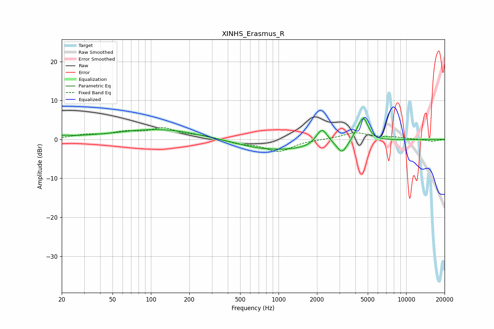

# XINHS_Erasmus_R
See [usage instructions](https://github.com/jaakkopasanen/AutoEq#usage) for more options and info.

### Parametric EQs
Apply preamp of -5.5 dB when using parametric equalizer.

|   # | Type    |   Fc (Hz) |    Q |   Gain (dB) |
|-----|---------|-----------|------|-------------|
|   1 | Peaking |        20 | 1.83 |         0.6 |
|   2 | Peaking |        33 | 1.55 |         0.2 |
|   3 | Peaking |       111 | 0.44 |         2.6 |
|   4 | Peaking |       168 | 1.72 |         0.1 |
|   5 | Peaking |       688 | 0.98 |        -0.5 |
|   6 | Peaking |      1210 | 0.42 |        -2.6 |
|   7 | Peaking |      2189 | 3.09 |         4.5 |
|   8 | Peaking |      3148 | 3.68 |        -3.1 |
|   9 | Peaking |      4259 | 3.34 |         2.1 |
|  10 | Peaking |      4666 | 4.02 |         4.7 |

### Fixed Band EQs
When using fixed band (also called graphic) equalizer, apply preamp of **-3.1 dB** (if available) and set gains manually with these parameters.

|   # | Type    |   Fc (Hz) |    Q |   Gain (dB) |
|-----|---------|-----------|------|-------------|
|   1 | Peaking |        31 | 1.41 |         1   |
|   2 | Peaking |        62 | 1.41 |         1.6 |
|   3 | Peaking |       125 | 1.41 |         2.6 |
|   4 | Peaking |       250 | 1.41 |         0.8 |
|   5 | Peaking |       500 | 1.41 |        -0.9 |
|   6 | Peaking |      1000 | 1.41 |        -3   |
|   7 | Peaking |      2000 | 1.41 |         0   |
|   8 | Peaking |      4000 | 1.41 |         1.7 |
|   9 | Peaking |      8000 | 1.41 |         0.5 |
|  10 | Peaking |     16000 | 1.41 |        -0.5 |

### Graphs

