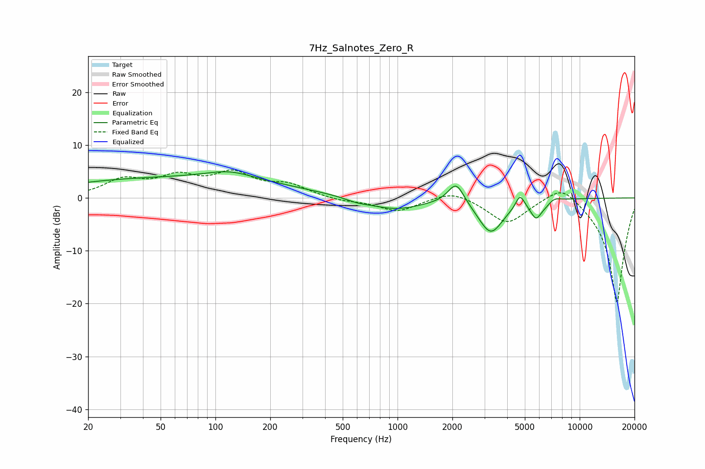

# 7Hz_Salnotes_Zero_R
See [usage instructions](https://github.com/jaakkopasanen/AutoEq#usage) for more options and info.

### Parametric EQs
Apply preamp of -5.1 dB when using parametric equalizer.

|   # | Type    |   Fc (Hz) |    Q |   Gain (dB) |
|-----|---------|-----------|------|-------------|
|   1 | Peaking |        59 | 0.2  |         3.8 |
|   2 | Peaking |       120 | 1.11 |         1.5 |
|   3 | Peaking |       600 | 2.12 |        -0.6 |
|   4 | Peaking |       968 | 0.99 |        -2.2 |
|   5 | Peaking |      2097 | 3.16 |         4.2 |
|   6 | Peaking |      3249 | 2.03 |        -6.6 |
|   7 | Peaking |      4700 | 5.98 |         2.5 |
|   8 | Peaking |      5752 | 4.86 |        -2.9 |
|   9 | Peaking |      6612 | 3.03 |        -1.6 |
|  10 | Peaking |      7054 | 3.22 |         1.5 |

### Fixed Band EQs
When using fixed band (also called graphic) equalizer, apply preamp of **-5.4 dB** (if available) and set gains manually with these parameters.

|   # | Type    |   Fc (Hz) |    Q |   Gain (dB) |
|-----|---------|-----------|------|-------------|
|   1 | Peaking |        31 | 1.41 |         3.2 |
|   2 | Peaking |        62 | 1.41 |         3.4 |
|   3 | Peaking |       125 | 1.41 |         4.2 |
|   4 | Peaking |       250 | 1.41 |         2.2 |
|   5 | Peaking |       500 | 1.41 |        -0.6 |
|   6 | Peaking |      1000 | 1.41 |        -2.5 |
|   7 | Peaking |      2000 | 1.41 |         1.7 |
|   8 | Peaking |      4000 | 1.41 |        -4.8 |
|   9 | Peaking |      8000 | 1.41 |         3.4 |
|  10 | Peaking |     16000 | 1.41 |       -20   |

### Graphs

