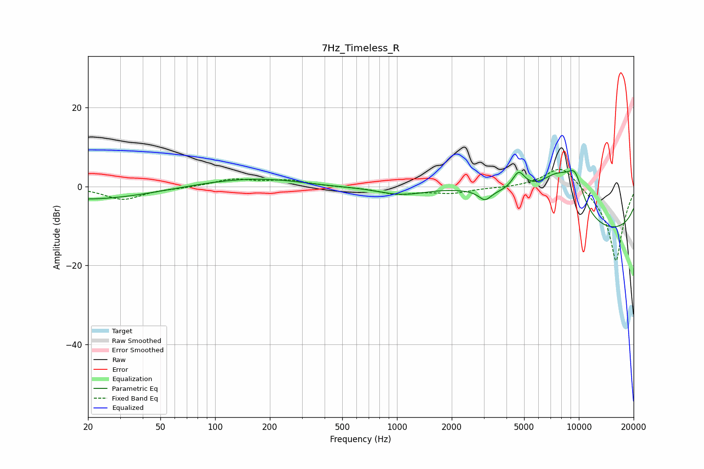

# 7Hz_Timeless_R
See [usage instructions](https://github.com/jaakkopasanen/AutoEq#usage) for more options and info.

### Parametric EQs
Apply preamp of -4.1 dB when using parametric equalizer.

|   # | Type    |   Fc (Hz) |    Q |   Gain (dB) |
|-----|---------|-----------|------|-------------|
|   1 | Peaking |        20 | 0.39 |        -3.3 |
|   2 | Peaking |       444 | 0.44 |        -6   |
|   3 | Peaking |       688 | 0.18 |         8.1 |
|   4 | Peaking |      1068 | 0.86 |        -3.7 |
|   5 | Peaking |      3045 | 4.22 |        -2.4 |
|   6 | Peaking |      4665 | 3.93 |         4.8 |
|   7 | Peaking |      5344 | 4.34 |         0   |
|   8 | Peaking |      7670 | 0.66 |        18.5 |
|   9 | Peaking |      9533 | 2.6  |         7.5 |
|  10 | Peaking |     10000 | 0.23 |       -20   |

### Fixed Band EQs
When using fixed band (also called graphic) equalizer, apply preamp of **-4.4 dB** (if available) and set gains manually with these parameters.

|   # | Type    |   Fc (Hz) |    Q |   Gain (dB) |
|-----|---------|-----------|------|-------------|
|   1 | Peaking |        31 | 1.41 |        -3.3 |
|   2 | Peaking |        62 | 1.41 |        -0.3 |
|   3 | Peaking |       125 | 1.41 |         1.8 |
|   4 | Peaking |       250 | 1.41 |         1.5 |
|   5 | Peaking |       500 | 1.41 |        -0.1 |
|   6 | Peaking |      1000 | 1.41 |        -1.8 |
|   7 | Peaking |      2000 | 1.41 |        -1.5 |
|   8 | Peaking |      4000 | 1.41 |        -0.2 |
|   9 | Peaking |      8000 | 1.41 |         6   |
|  10 | Peaking |     16000 | 1.41 |       -19.3 |

### Graphs

