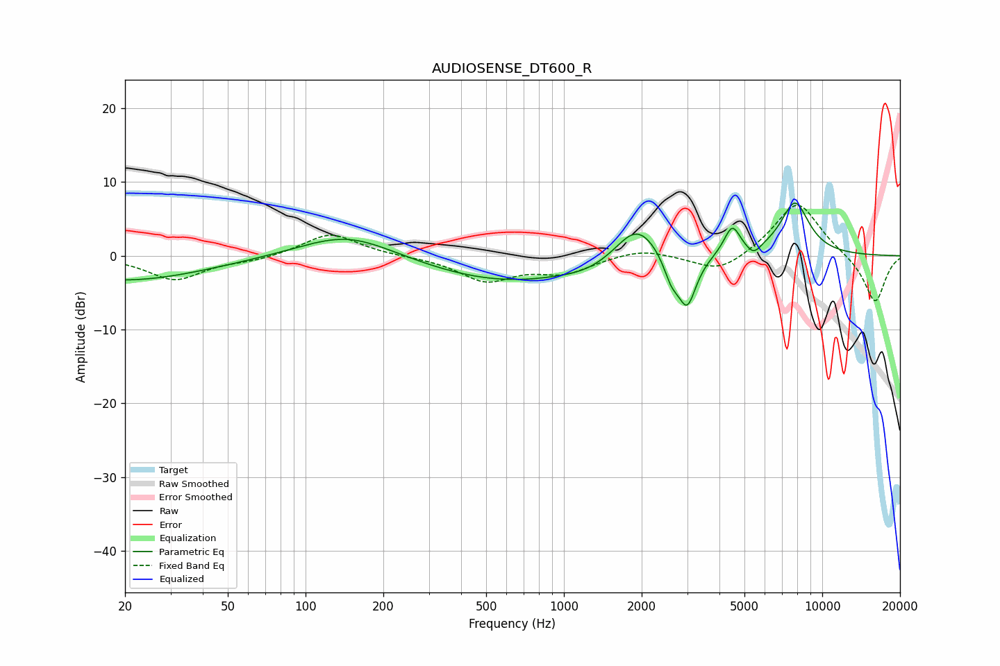

# AUDIOSENSE_DT600_R
See [usage instructions](https://github.com/jaakkopasanen/AutoEq#usage) for more options and info.

### Parametric EQs
Apply preamp of -7.2 dB when using parametric equalizer.

|   # | Type    |   Fc (Hz) |    Q |   Gain (dB) |
|-----|---------|-----------|------|-------------|
|   1 | Peaking |        20 | 0.45 |        -3.4 |
|   2 | Peaking |       146 | 0.78 |         3.4 |
|   3 | Peaking |       596 | 0.45 |        -3.6 |
|   4 | Peaking |      1277 | 1.32 |        -0.9 |
|   5 | Peaking |      1915 | 1.67 |         5.3 |
|   6 | Peaking |      2603 | 4.71 |        -2.9 |
|   7 | Peaking |      2999 | 3.86 |        -6.9 |
|   8 | Peaking |      4482 | 4.47 |         3.8 |
|   9 | Peaking |      5428 | 5.03 |        -1.4 |
|  10 | Peaking |      7839 | 2.34 |         7.2 |

### Fixed Band EQs
When using fixed band (also called graphic) equalizer, apply preamp of **-6.9 dB** (if available) and set gains manually with these parameters.

|   # | Type    |   Fc (Hz) |    Q |   Gain (dB) |
|-----|---------|-----------|------|-------------|
|   1 | Peaking |        31 | 1.41 |        -3.2 |
|   2 | Peaking |        62 | 1.41 |        -0.6 |
|   3 | Peaking |       125 | 1.41 |         3.1 |
|   4 | Peaking |       250 | 1.41 |        -0.1 |
|   5 | Peaking |       500 | 1.41 |        -3.3 |
|   6 | Peaking |      1000 | 1.41 |        -2.1 |
|   7 | Peaking |      2000 | 1.41 |         1.1 |
|   8 | Peaking |      4000 | 1.41 |        -2.5 |
|   9 | Peaking |      8000 | 1.41 |         7.5 |
|  10 | Peaking |     16000 | 1.41 |        -6.5 |

### Graphs

