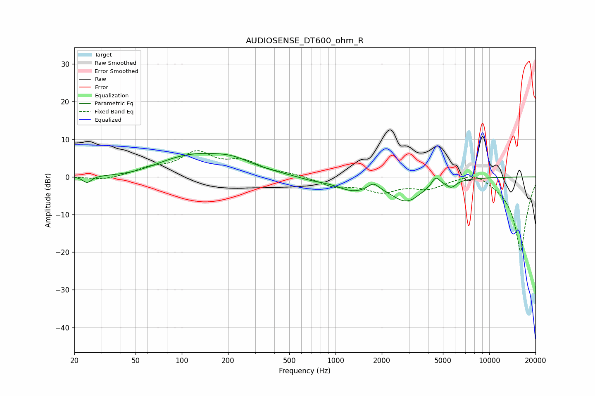

# AUDIOSENSE_DT600_ohm_R
See [usage instructions](https://github.com/jaakkopasanen/AutoEq#usage) for more options and info.

### Parametric EQs
Apply preamp of -6.3 dB when using parametric equalizer.

|   # | Type    |   Fc (Hz) |    Q |   Gain (dB) |
|-----|---------|-----------|------|-------------|
|   1 | Peaking |        24 | 5.03 |        -1.8 |
|   2 | Peaking |        49 | 0.79 |        -1.4 |
|   3 | Peaking |       116 | 0.52 |         6   |
|   4 | Peaking |       215 | 1.2  |         1.8 |
|   5 | Peaking |       705 | 1.45 |        -0.8 |
|   6 | Peaking |      1295 | 1.33 |        -3   |
|   7 | Peaking |      1766 | 4.09 |         1.8 |
|   8 | Peaking |      2894 | 1.35 |        -6.1 |
|   9 | Peaking |      4481 | 5.54 |         2.4 |
|  10 | Peaking |      5673 | 4.51 |        -1.8 |

### Fixed Band EQs
When using fixed band (also called graphic) equalizer, apply preamp of **-7.1 dB** (if available) and set gains manually with these parameters.

|   # | Type    |   Fc (Hz) |    Q |   Gain (dB) |
|-----|---------|-----------|------|-------------|
|   1 | Peaking |        31 | 1.41 |        -1   |
|   2 | Peaking |        62 | 1.41 |         1.9 |
|   3 | Peaking |       125 | 1.41 |         6   |
|   4 | Peaking |       250 | 1.41 |         3.6 |
|   5 | Peaking |       500 | 1.41 |         0.7 |
|   6 | Peaking |      1000 | 1.41 |        -2.4 |
|   7 | Peaking |      2000 | 1.41 |        -3.5 |
|   8 | Peaking |      4000 | 1.41 |        -2.6 |
|   9 | Peaking |      8000 | 1.41 |         2.2 |
|  10 | Peaking |     16000 | 1.41 |       -20   |

### Graphs

