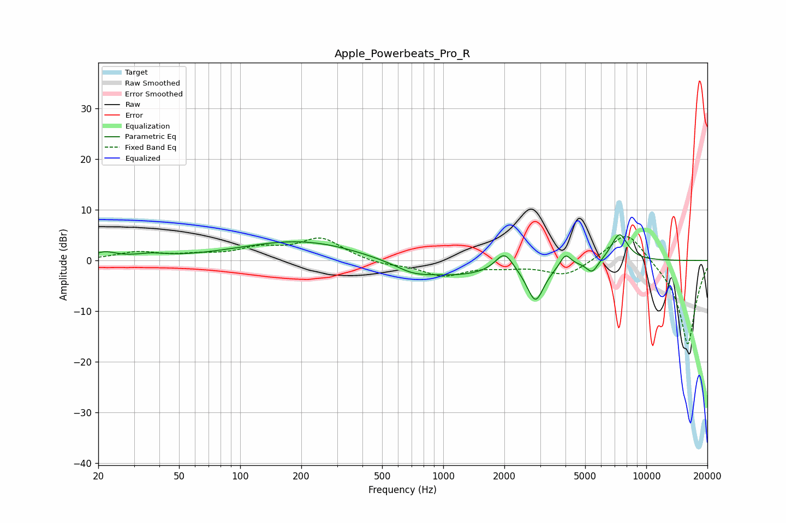

# Apple_Powerbeats_Pro_R
See [usage instructions](https://github.com/jaakkopasanen/AutoEq#usage) for more options and info.

### Parametric EQs
Apply preamp of -5.2 dB when using parametric equalizer.

|   # | Type    |   Fc (Hz) |    Q |   Gain (dB) |
|-----|---------|-----------|------|-------------|
|   1 | Peaking |        21 | 2.47 |         1.4 |
|   2 | Peaking |        36 | 1.84 |         0.8 |
|   3 | Peaking |       203 | 0.46 |         4   |
|   4 | Peaking |       707 | 1.81 |        -1.1 |
|   5 | Peaking |      1084 | 0.55 |        -3.2 |
|   6 | Peaking |      2000 | 3.18 |         4   |
|   7 | Peaking |      2846 | 3.33 |        -7.3 |
|   8 | Peaking |      3998 | 5.43 |         2.5 |
|   9 | Peaking |      5417 | 4.62 |        -2.5 |
|  10 | Peaking |      7370 | 3.23 |         5.5 |

### Fixed Band EQs
When using fixed band (also called graphic) equalizer, apply preamp of **-4.8 dB** (if available) and set gains manually with these parameters.

|   # | Type    |   Fc (Hz) |    Q |   Gain (dB) |
|-----|---------|-----------|------|-------------|
|   1 | Peaking |        31 | 1.41 |         1.5 |
|   2 | Peaking |        62 | 1.41 |         0.8 |
|   3 | Peaking |       125 | 1.41 |         2.1 |
|   4 | Peaking |       250 | 1.41 |         4.3 |
|   5 | Peaking |       500 | 1.41 |        -0.8 |
|   6 | Peaking |      1000 | 1.41 |        -2.9 |
|   7 | Peaking |      2000 | 1.41 |        -0.9 |
|   8 | Peaking |      4000 | 1.41 |        -3   |
|   9 | Peaking |      8000 | 1.41 |         6.5 |
|  10 | Peaking |     16000 | 1.41 |       -16.9 |

### Graphs

