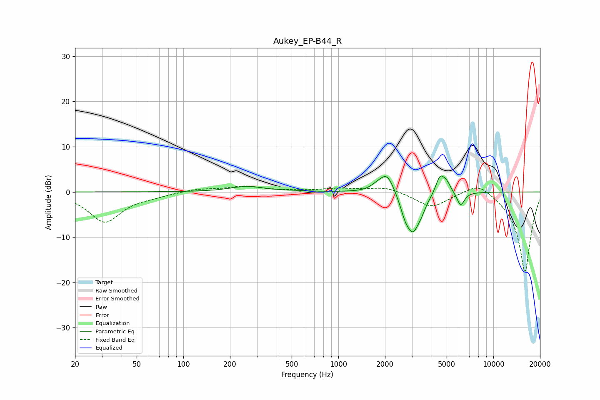

# Aukey_EP-B44_R
See [usage instructions](https://github.com/jaakkopasanen/AutoEq#usage) for more options and info.

### Parametric EQs
Apply preamp of -3.6 dB when using parametric equalizer.

|   # | Type    |   Fc (Hz) |    Q |   Gain (dB) |
|-----|---------|-----------|------|-------------|
|   1 | Peaking |       257 | 1.33 |         1.2 |
|   2 | Peaking |       509 | 1.83 |         0.1 |
|   3 | Peaking |      1755 | 3.93 |         0.6 |
|   4 | Peaking |      2060 | 2.88 |         4.7 |
|   5 | Peaking |      2684 | 4.93 |        -2.1 |
|   6 | Peaking |      3023 | 2.91 |        -8.7 |
|   7 | Peaking |      3431 | 5.99 |        -1.1 |
|   8 | Peaking |      4519 | 5.04 |         3.8 |
|   9 | Peaking |      4981 | 4.87 |         2.1 |
|  10 | Peaking |      6152 | 5.7  |        -3.1 |

### Fixed Band EQs
When using fixed band (also called graphic) equalizer, apply preamp of **-1.4 dB** (if available) and set gains manually with these parameters.

|   # | Type    |   Fc (Hz) |    Q |   Gain (dB) |
|-----|---------|-----------|------|-------------|
|   1 | Peaking |        31 | 1.41 |        -6.6 |
|   2 | Peaking |        62 | 1.41 |        -0.6 |
|   3 | Peaking |       125 | 1.41 |         0.7 |
|   4 | Peaking |       250 | 1.41 |         1.2 |
|   5 | Peaking |       500 | 1.41 |         0.2 |
|   6 | Peaking |      1000 | 1.41 |         0.7 |
|   7 | Peaking |      2000 | 1.41 |         1.2 |
|   8 | Peaking |      4000 | 1.41 |        -3.4 |
|   9 | Peaking |      8000 | 1.41 |         2.7 |
|  10 | Peaking |     16000 | 1.41 |       -17.8 |

### Graphs

