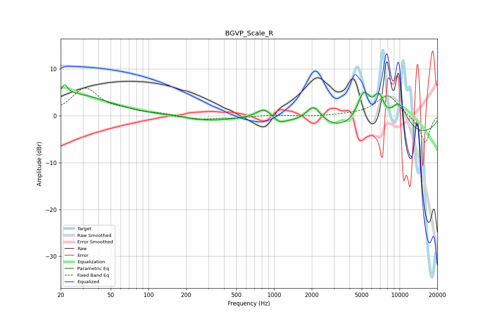

# BGVP_Scale_R
See [usage instructions](https://github.com/jaakkopasanen/AutoEq#usage) for more options and info.

### Parametric EQs
Apply preamp of -6.7 dB when using parametric equalizer.

|   # | Type    |   Fc (Hz) |    Q |   Gain (dB) |
|-----|---------|-----------|------|-------------|
|   1 | Peaking |        21 | 5.99 |         2.1 |
|   2 | Peaking |        25 | 0.51 |         4.6 |
|   3 | Peaking |       307 | 0.81 |        -1   |
|   4 | Peaking |       835 | 2.31 |         2.2 |
|   5 | Peaking |      1103 | 2.96 |        -1.1 |
|   6 | Peaking |      2062 | 2.32 |         4   |
|   7 | Peaking |      5186 | 2.43 |         7.5 |
|   8 | Peaking |      6830 | 3.17 |         5.4 |
|   9 | Peaking |      8660 | 0.19 |        -4.7 |
|  10 | Peaking |      9885 | 1.64 |         6.2 |

### Fixed Band EQs
When using fixed band (also called graphic) equalizer, apply preamp of **-6.0 dB** (if available) and set gains manually with these parameters.

|   # | Type    |   Fc (Hz) |    Q |   Gain (dB) |
|-----|---------|-----------|------|-------------|
|   1 | Peaking |        31 | 1.41 |         5.7 |
|   2 | Peaking |        62 | 1.41 |         0.9 |
|   3 | Peaking |       125 | 1.41 |         0.4 |
|   4 | Peaking |       250 | 1.41 |        -0.9 |
|   5 | Peaking |       500 | 1.41 |        -0.4 |
|   6 | Peaking |      1000 | 1.41 |         0.2 |
|   7 | Peaking |      2000 | 1.41 |        -0.2 |
|   8 | Peaking |      4000 | 1.41 |         0.1 |
|   9 | Peaking |      8000 | 1.41 |         4.5 |
|  10 | Peaking |     16000 | 1.41 |        -5.9 |

### Graphs

