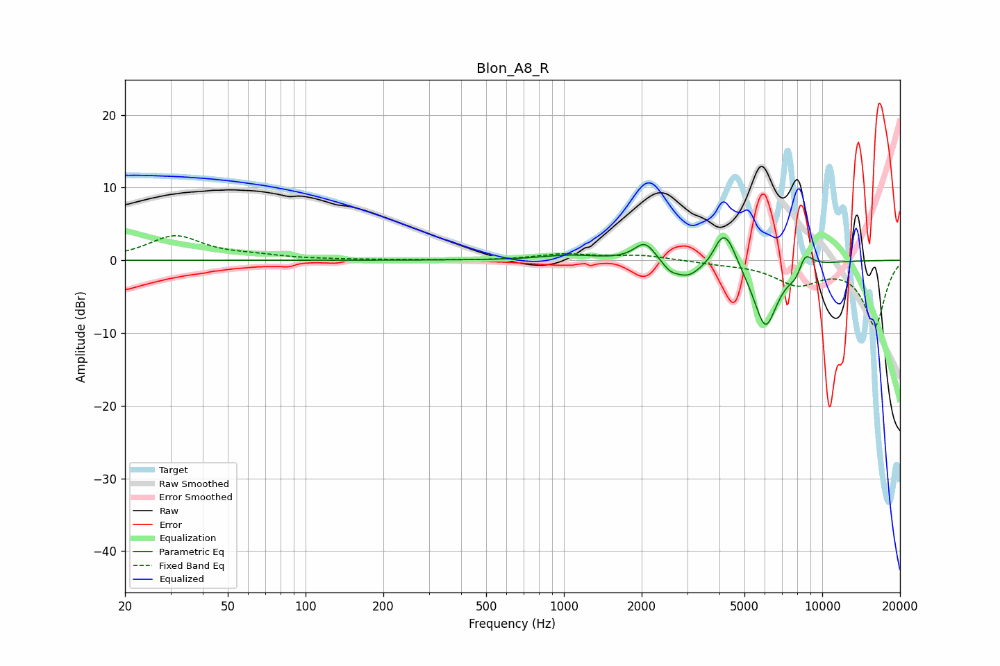

# Blon_A8_R
See [usage instructions](https://github.com/jaakkopasanen/AutoEq#usage) for more options and info.

### Parametric EQs
Apply preamp of -3.2 dB when using parametric equalizer.

|   # | Type    |   Fc (Hz) |    Q |   Gain (dB) |
|-----|---------|-----------|------|-------------|
|   1 | Peaking |       326 | 1.4  |         0   |
|   2 | Peaking |      1058 | 1.29 |         0.7 |
|   3 | Peaking |      2059 | 3.44 |         2.6 |
|   4 | Peaking |      2572 | 4.83 |        -0.9 |
|   5 | Peaking |      3009 | 2.53 |        -2.3 |
|   6 | Peaking |      4007 | 5.99 |         1.1 |
|   7 | Peaking |      4273 | 3.52 |         4.5 |
|   8 | Peaking |      6029 | 2.8  |        -9.3 |
|   9 | Peaking |      8067 | 3.88 |        -2.5 |
|  10 | Peaking |      8502 | 4.22 |         3.6 |

### Fixed Band EQs
When using fixed band (also called graphic) equalizer, apply preamp of **-3.5 dB** (if available) and set gains manually with these parameters.

|   # | Type    |   Fc (Hz) |    Q |   Gain (dB) |
|-----|---------|-----------|------|-------------|
|   1 | Peaking |        31 | 1.41 |         3.3 |
|   2 | Peaking |        62 | 1.41 |         0.5 |
|   3 | Peaking |       125 | 1.41 |         0.1 |
|   4 | Peaking |       250 | 1.41 |         0   |
|   5 | Peaking |       500 | 1.41 |        -0   |
|   6 | Peaking |      1000 | 1.41 |         0.8 |
|   7 | Peaking |      2000 | 1.41 |         0.7 |
|   8 | Peaking |      4000 | 1.41 |        -0.3 |
|   9 | Peaking |      8000 | 1.41 |        -3   |
|  10 | Peaking |     16000 | 1.41 |        -8.9 |

### Graphs

