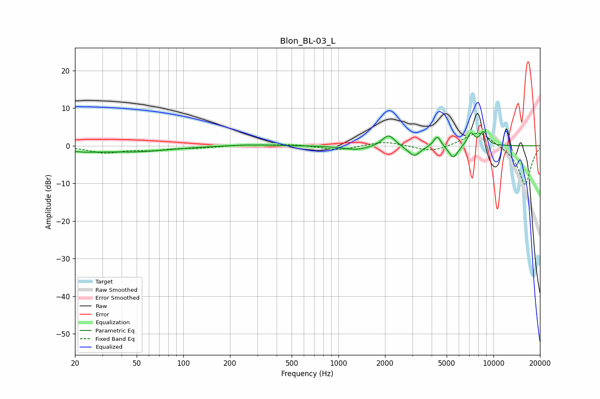

# Blon_BL-03_L
See [usage instructions](https://github.com/jaakkopasanen/AutoEq#usage) for more options and info.

### Parametric EQs
Apply preamp of -3.9 dB when using parametric equalizer.

|   # | Type    |   Fc (Hz) |    Q |   Gain (dB) |
|-----|---------|-----------|------|-------------|
|   1 | Peaking |        22 | 1.2  |        -1   |
|   2 | Peaking |        49 | 0.65 |        -1.5 |
|   3 | Peaking |       277 | 1    |         0.3 |
|   4 | Peaking |      1301 | 1.67 |        -1.1 |
|   5 | Peaking |      2107 | 3.6  |         3.2 |
|   6 | Peaking |      3079 | 3.71 |        -2.9 |
|   7 | Peaking |      4351 | 5.94 |         2.9 |
|   8 | Peaking |      5518 | 4.6  |        -3.4 |
|   9 | Peaking |      7160 | 5.82 |         3.3 |
|  10 | Peaking |      8639 | 5.53 |         3.5 |

### Fixed Band EQs
When using fixed band (also called graphic) equalizer, apply preamp of **-3.4 dB** (if available) and set gains manually with these parameters.

|   # | Type    |   Fc (Hz) |    Q |   Gain (dB) |
|-----|---------|-----------|------|-------------|
|   1 | Peaking |        31 | 1.41 |        -1.8 |
|   2 | Peaking |        62 | 1.41 |        -0.9 |
|   3 | Peaking |       125 | 1.41 |        -0.5 |
|   4 | Peaking |       250 | 1.41 |         0.3 |
|   5 | Peaking |       500 | 1.41 |         0.4 |
|   6 | Peaking |      1000 | 1.41 |        -1.2 |
|   7 | Peaking |      2000 | 1.41 |         1.2 |
|   8 | Peaking |      4000 | 1.41 |        -1.7 |
|   9 | Peaking |      8000 | 1.41 |         4.1 |
|  10 | Peaking |     16000 | 1.41 |       -10.5 |

### Graphs

