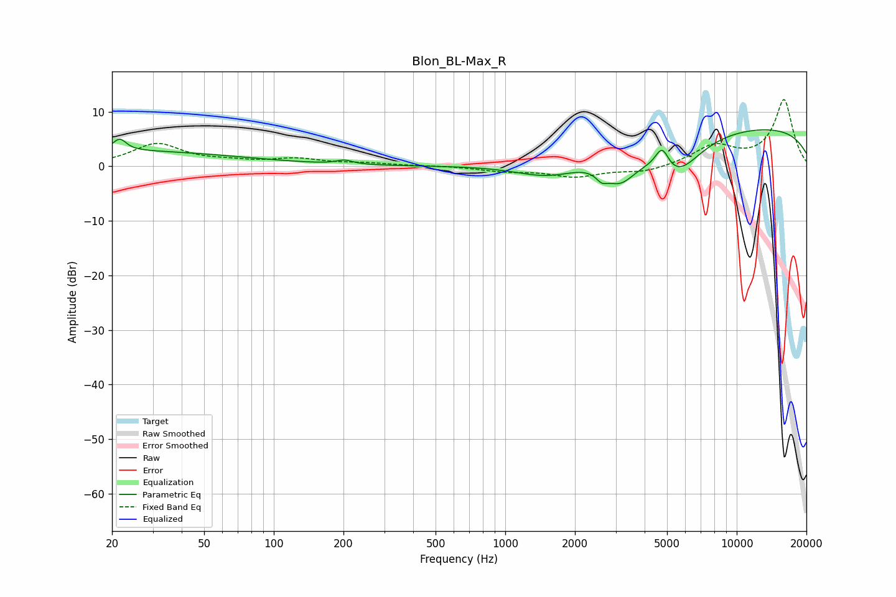

# Blon_BL-Max_R
See [usage instructions](https://github.com/jaakkopasanen/AutoEq#usage) for more options and info.

### Parametric EQs
Apply preamp of -6.8 dB when using parametric equalizer.

|   # | Type    |   Fc (Hz) |    Q |   Gain (dB) |
|-----|---------|-----------|------|-------------|
|   1 | Peaking |        20 | 0.24 |         2.8 |
|   2 | Peaking |        22 | 5.15 |         2.1 |
|   3 | Peaking |       202 | 4.2  |         0.7 |
|   4 | Peaking |      1562 | 0.93 |        -3.5 |
|   5 | Peaking |      2611 | 5.76 |        -1.4 |
|   6 | Peaking |      3127 | 1.91 |        -5.4 |
|   7 | Peaking |      4760 | 4.63 |         4.2 |
|   8 | Peaking |      5480 | 1.28 |        -7.2 |
|   9 | Peaking |      8789 | 0.18 |         2.3 |
|  10 | Peaking |     10000 | 0.18 |         5.3 |

### Fixed Band EQs
When using fixed band (also called graphic) equalizer, apply preamp of **-12.3 dB** (if available) and set gains manually with these parameters.

|   # | Type    |   Fc (Hz) |    Q |   Gain (dB) |
|-----|---------|-----------|------|-------------|
|   1 | Peaking |        31 | 1.41 |         4   |
|   2 | Peaking |        62 | 1.41 |         0.6 |
|   3 | Peaking |       125 | 1.41 |         1.2 |
|   4 | Peaking |       250 | 1.41 |         0.5 |
|   5 | Peaking |       500 | 1.41 |         0.1 |
|   6 | Peaking |      1000 | 1.41 |        -0.8 |
|   7 | Peaking |      2000 | 1.41 |        -1.8 |
|   8 | Peaking |      4000 | 1.41 |        -1.1 |
|   9 | Peaking |      8000 | 1.41 |         3.6 |
|  10 | Peaking |     16000 | 1.41 |        12.1 |

### Graphs

