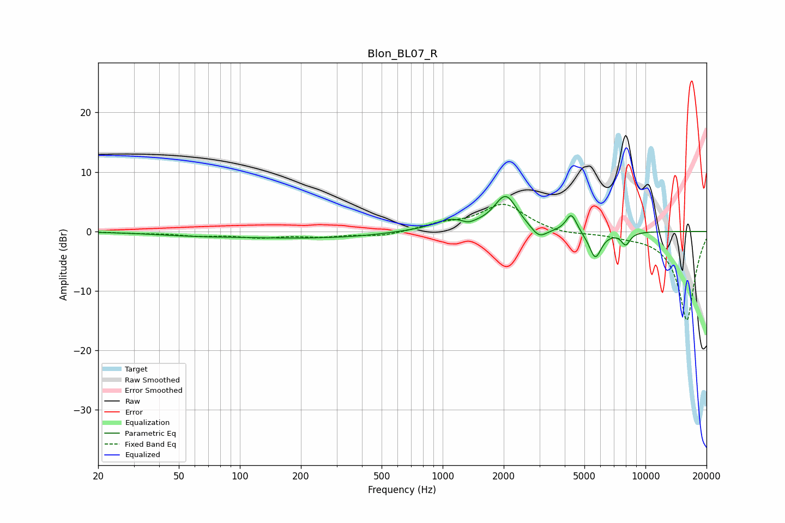

# Blon_BL07_R
See [usage instructions](https://github.com/jaakkopasanen/AutoEq#usage) for more options and info.

### Parametric EQs
Apply preamp of -6.0 dB when using parametric equalizer.

|   # | Type    |   Fc (Hz) |    Q |   Gain (dB) |
|-----|---------|-----------|------|-------------|
|   1 | Peaking |        58 | 0.68 |        -0.4 |
|   2 | Peaking |       241 | 0.35 |        -1.1 |
|   3 | Peaking |       638 | 1.05 |         0.3 |
|   4 | Peaking |      1089 | 1.67 |         1.8 |
|   5 | Peaking |      1337 | 5.42 |        -0.5 |
|   6 | Peaking |      2045 | 2.44 |         5.9 |
|   7 | Peaking |      2987 | 3.55 |        -1.9 |
|   8 | Peaking |      4311 | 5.34 |         3.1 |
|   9 | Peaking |      5656 | 4.5  |        -4.6 |
|  10 | Peaking |      7991 | 5.96 |        -2.1 |

### Fixed Band EQs
When using fixed band (also called graphic) equalizer, apply preamp of **-4.7 dB** (if available) and set gains manually with these parameters.

|   # | Type    |   Fc (Hz) |    Q |   Gain (dB) |
|-----|---------|-----------|------|-------------|
|   1 | Peaking |        31 | 1.41 |        -0.2 |
|   2 | Peaking |        62 | 1.41 |        -0.6 |
|   3 | Peaking |       125 | 1.41 |        -0.9 |
|   4 | Peaking |       250 | 1.41 |        -0.7 |
|   5 | Peaking |       500 | 1.41 |        -0.8 |
|   6 | Peaking |      1000 | 1.41 |         1.1 |
|   7 | Peaking |      2000 | 1.41 |         4.6 |
|   8 | Peaking |      4000 | 1.41 |        -0.5 |
|   9 | Peaking |      8000 | 1.41 |        -0.4 |
|  10 | Peaking |     16000 | 1.41 |       -15   |

### Graphs

