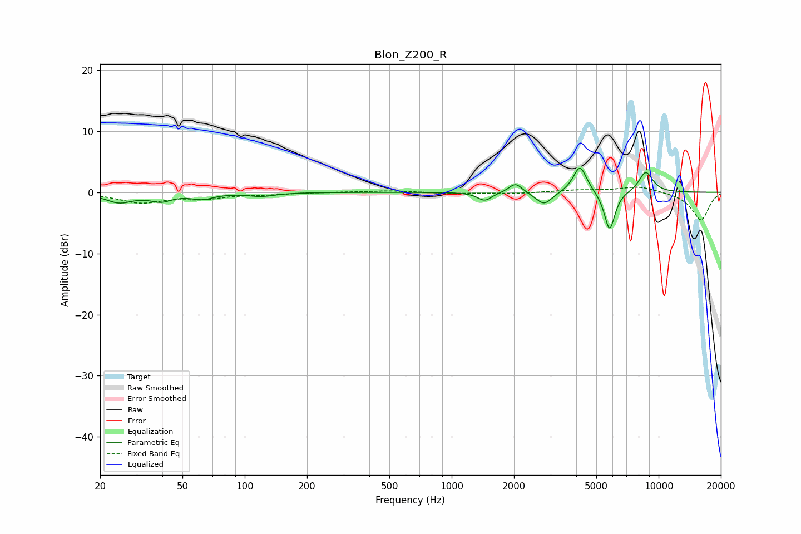

# Blon_Z200_R
See [usage instructions](https://github.com/jaakkopasanen/AutoEq#usage) for more options and info.

### Parametric EQs
Apply preamp of -4.0 dB when using parametric equalizer.

|   # | Type    |   Fc (Hz) |    Q |   Gain (dB) |
|-----|---------|-----------|------|-------------|
|   1 | Peaking |        25 | 2.14 |        -1.6 |
|   2 | Peaking |        39 | 2.7  |        -1.2 |
|   3 | Peaking |        62 | 2.58 |        -0.9 |
|   4 | Peaking |       120 | 2.24 |        -0.6 |
|   5 | Peaking |      1443 | 4.21 |        -1.4 |
|   6 | Peaking |      2035 | 4.51 |         1.6 |
|   7 | Peaking |      2794 | 3.54 |        -2.1 |
|   8 | Peaking |      4169 | 4.29 |         4.5 |
|   9 | Peaking |      5799 | 5.34 |        -6.5 |
|  10 | Peaking |      8678 | 3.77 |         3.4 |

### Fixed Band EQs
When using fixed band (also called graphic) equalizer, apply preamp of **-0.9 dB** (if available) and set gains manually with these parameters.

|   # | Type    |   Fc (Hz) |    Q |   Gain (dB) |
|-----|---------|-----------|------|-------------|
|   1 | Peaking |        31 | 1.41 |        -1.6 |
|   2 | Peaking |        62 | 1.41 |        -0.9 |
|   3 | Peaking |       125 | 1.41 |        -0.3 |
|   4 | Peaking |       250 | 1.41 |         0   |
|   5 | Peaking |       500 | 1.41 |         0.3 |
|   6 | Peaking |      1000 | 1.41 |        -0.2 |
|   7 | Peaking |      2000 | 1.41 |        -0.2 |
|   8 | Peaking |      4000 | 1.41 |         0.3 |
|   9 | Peaking |      8000 | 1.41 |         1   |
|  10 | Peaking |     16000 | 1.41 |        -4.6 |

### Graphs

