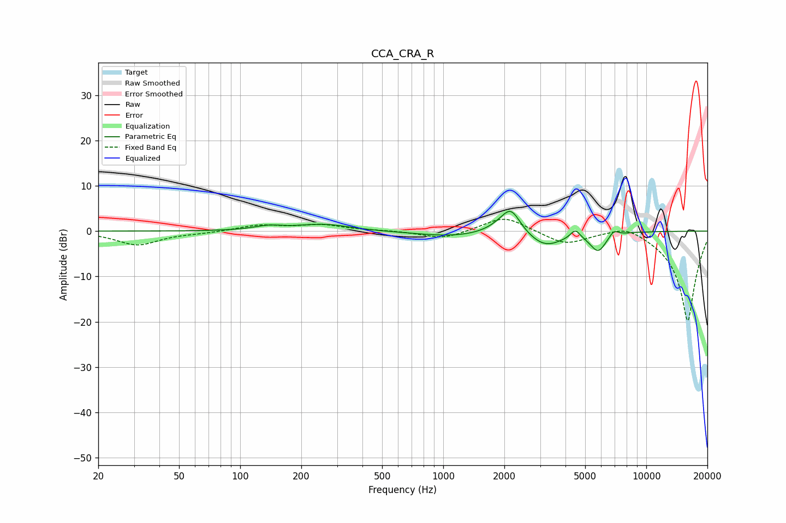

# CCA_CRA_R
See [usage instructions](https://github.com/jaakkopasanen/AutoEq#usage) for more options and info.

### Parametric EQs
Apply preamp of -4.4 dB when using parametric equalizer.

|   # | Type    |   Fc (Hz) |    Q |   Gain (dB) |
|-----|---------|-----------|------|-------------|
|   1 | Peaking |       138 | 2    |         0.9 |
|   2 | Peaking |       257 | 1.11 |         1.5 |
|   3 | Peaking |       648 | 0.96 |        -0   |
|   4 | Peaking |      1109 | 0.83 |        -1.2 |
|   5 | Peaking |      1974 | 2.06 |         1.7 |
|   6 | Peaking |      2162 | 3.13 |         4.5 |
|   7 | Peaking |      3170 | 1.67 |        -3.4 |
|   8 | Peaking |      4472 | 6    |         2   |
|   9 | Peaking |      5794 | 3.46 |        -4.1 |
|  10 | Peaking |      6913 | 6    |         1.4 |

### Fixed Band EQs
When using fixed band (also called graphic) equalizer, apply preamp of **-2.7 dB** (if available) and set gains manually with these parameters.

|   # | Type    |   Fc (Hz) |    Q |   Gain (dB) |
|-----|---------|-----------|------|-------------|
|   1 | Peaking |        31 | 1.41 |        -3   |
|   2 | Peaking |        62 | 1.41 |        -0.3 |
|   3 | Peaking |       125 | 1.41 |         1.3 |
|   4 | Peaking |       250 | 1.41 |         1.3 |
|   5 | Peaking |       500 | 1.41 |         0.1 |
|   6 | Peaking |      1000 | 1.41 |        -1.8 |
|   7 | Peaking |      2000 | 1.41 |         3.5 |
|   8 | Peaking |      4000 | 1.41 |        -2.9 |
|   9 | Peaking |      8000 | 1.41 |         2   |
|  10 | Peaking |     16000 | 1.41 |       -20   |

### Graphs

