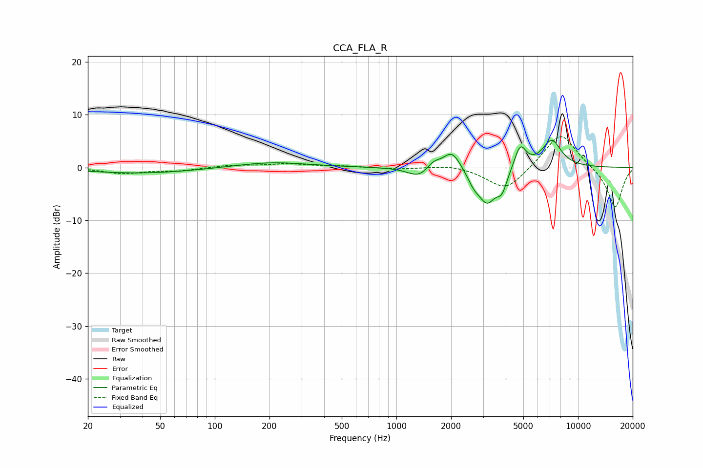

# CCA_FLA_R
See [usage instructions](https://github.com/jaakkopasanen/AutoEq#usage) for more options and info.

### Parametric EQs
Apply preamp of -5.2 dB when using parametric equalizer.

|   # | Type    |   Fc (Hz) |    Q |   Gain (dB) |
|-----|---------|-----------|------|-------------|
|   1 | Peaking |        39 | 0.48 |        -1.1 |
|   2 | Peaking |       205 | 0.73 |         1   |
|   3 | Peaking |      1330 | 2.37 |        -1.9 |
|   4 | Peaking |      1597 | 3.76 |         1.3 |
|   5 | Peaking |      2024 | 2.88 |         3.6 |
|   6 | Peaking |      2663 | 3.89 |        -1.9 |
|   7 | Peaking |      3159 | 2.8  |        -6.2 |
|   8 | Peaking |      3813 | 4.81 |        -3.3 |
|   9 | Peaking |      4808 | 4.3  |         4.4 |
|  10 | Peaking |      7161 | 2.54 |         5.1 |

### Fixed Band EQs
When using fixed band (also called graphic) equalizer, apply preamp of **-5.9 dB** (if available) and set gains manually with these parameters.

|   # | Type    |   Fc (Hz) |    Q |   Gain (dB) |
|-----|---------|-----------|------|-------------|
|   1 | Peaking |        31 | 1.41 |        -1.1 |
|   2 | Peaking |        62 | 1.41 |        -0.6 |
|   3 | Peaking |       125 | 1.41 |         0.4 |
|   4 | Peaking |       250 | 1.41 |         0.6 |
|   5 | Peaking |       500 | 1.41 |         0.3 |
|   6 | Peaking |      1000 | 1.41 |        -0.3 |
|   7 | Peaking |      2000 | 1.41 |         0.6 |
|   8 | Peaking |      4000 | 1.41 |        -4.5 |
|   9 | Peaking |      8000 | 1.41 |         6.9 |
|  10 | Peaking |     16000 | 1.41 |        -7.8 |

### Graphs

