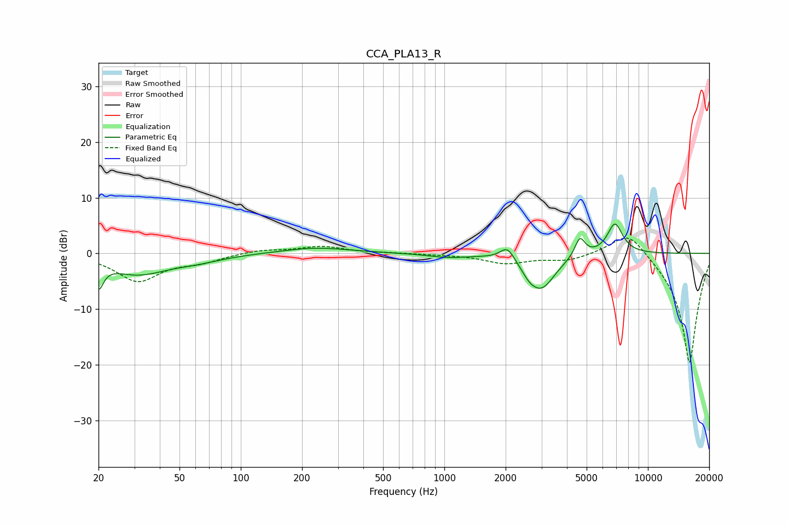

# CCA_PLA13_R
See [usage instructions](https://github.com/jaakkopasanen/AutoEq#usage) for more options and info.

### Parametric EQs
Apply preamp of -5.4 dB when using parametric equalizer.

|   # | Type    |   Fc (Hz) |    Q |   Gain (dB) |
|-----|---------|-----------|------|-------------|
|   1 | Peaking |        20 | 5.96 |        -4.4 |
|   2 | Peaking |        31 | 0.98 |        -3.5 |
|   3 | Peaking |        61 | 1.09 |        -1   |
|   4 | Peaking |       235 | 0.86 |         1.1 |
|   5 | Peaking |      1046 | 1.47 |        -0.7 |
|   6 | Peaking |      2040 | 4.04 |         2.5 |
|   7 | Peaking |      2615 | 3.9  |        -1.4 |
|   8 | Peaking |      3010 | 2.08 |        -6   |
|   9 | Peaking |      4634 | 5.57 |         3.5 |
|  10 | Peaking |      6886 | 3.56 |         5.5 |

### Fixed Band EQs
When using fixed band (also called graphic) equalizer, apply preamp of **-2.8 dB** (if available) and set gains manually with these parameters.

|   # | Type    |   Fc (Hz) |    Q |   Gain (dB) |
|-----|---------|-----------|------|-------------|
|   1 | Peaking |        31 | 1.41 |        -4.9 |
|   2 | Peaking |        62 | 1.41 |        -1.3 |
|   3 | Peaking |       125 | 1.41 |         0.7 |
|   4 | Peaking |       250 | 1.41 |         1.2 |
|   5 | Peaking |       500 | 1.41 |         0.1 |
|   6 | Peaking |      1000 | 1.41 |        -0.1 |
|   7 | Peaking |      2000 | 1.41 |        -1.7 |
|   8 | Peaking |      4000 | 1.41 |        -1.2 |
|   9 | Peaking |      8000 | 1.41 |         4.7 |
|  10 | Peaking |     16000 | 1.41 |       -20   |

### Graphs

