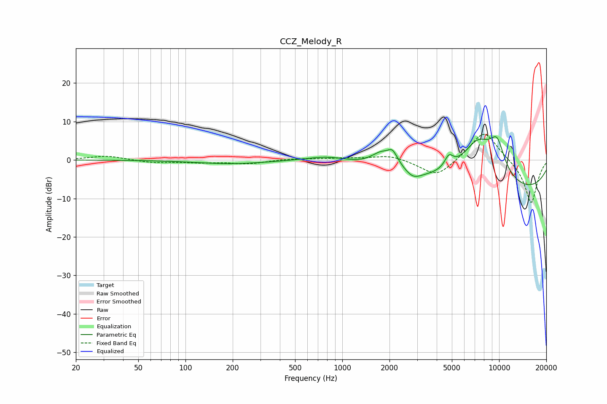

# CCZ_Melody_R
See [usage instructions](https://github.com/jaakkopasanen/AutoEq#usage) for more options and info.

### Parametric EQs
Apply preamp of -6.2 dB when using parametric equalizer.

|   # | Type    |   Fc (Hz) |    Q |   Gain (dB) |
|-----|---------|-----------|------|-------------|
|   1 | Peaking |       196 | 0.63 |        -1   |
|   2 | Peaking |       821 | 0.99 |         1.6 |
|   3 | Peaking |      1775 | 2.04 |         4   |
|   4 | Peaking |      2087 | 4.8  |         2.5 |
|   5 | Peaking |      2207 | 2.72 |         1   |
|   6 | Peaking |      2829 | 2.91 |        -1.7 |
|   7 | Peaking |      4785 | 5.09 |         3   |
|   8 | Peaking |      7354 | 1.01 |        13.1 |
|   9 | Peaking |      9427 | 0.2  |       -10   |
|  10 | Peaking |      9714 | 2.54 |         7.5 |

### Fixed Band EQs
When using fixed band (also called graphic) equalizer, apply preamp of **-6.8 dB** (if available) and set gains manually with these parameters.

|   # | Type    |   Fc (Hz) |    Q |   Gain (dB) |
|-----|---------|-----------|------|-------------|
|   1 | Peaking |        31 | 1.41 |         1.1 |
|   2 | Peaking |        62 | 1.41 |        -0.7 |
|   3 | Peaking |       125 | 1.41 |        -0.6 |
|   4 | Peaking |       250 | 1.41 |        -0.9 |
|   5 | Peaking |       500 | 1.41 |         0.4 |
|   6 | Peaking |      1000 | 1.41 |         0.4 |
|   7 | Peaking |      2000 | 1.41 |         1.3 |
|   8 | Peaking |      4000 | 1.41 |        -4.6 |
|   9 | Peaking |      8000 | 1.41 |         8   |
|  10 | Peaking |     16000 | 1.41 |       -11.5 |

### Graphs

