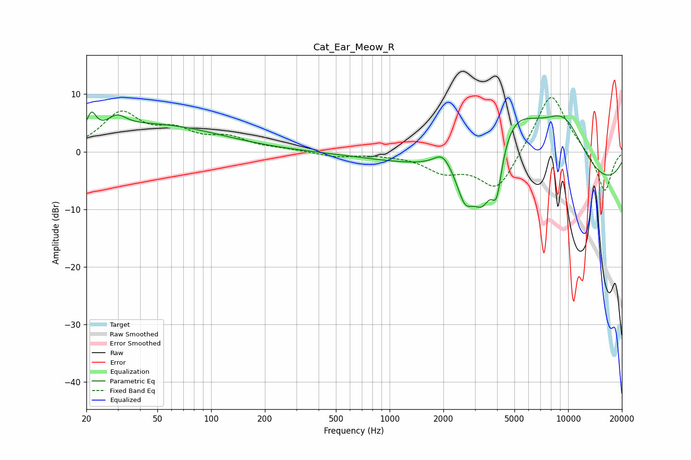

# Cat_Ear_Meow_R
See [usage instructions](https://github.com/jaakkopasanen/AutoEq#usage) for more options and info.

### Parametric EQs
Apply preamp of -7.0 dB when using parametric equalizer.

|   # | Type    |   Fc (Hz) |    Q |   Gain (dB) |
|-----|---------|-----------|------|-------------|
|   1 | Peaking |        21 | 5.77 |         3.2 |
|   2 | Peaking |        30 | 2.79 |         2.1 |
|   3 | Peaking |        47 | 0.38 |         4.6 |
|   4 | Peaking |      1981 | 2.96 |         2.5 |
|   5 | Peaking |      2642 | 3.03 |        -5.8 |
|   6 | Peaking |      3307 | 2.14 |        -9.5 |
|   7 | Peaking |      3979 | 4.74 |        -7.7 |
|   8 | Peaking |      4846 | 0.58 |        16.4 |
|   9 | Peaking |      7188 | 0.19 |       -11.8 |
|  10 | Peaking |      9544 | 0.89 |         9.8 |

### Fixed Band EQs
When using fixed band (also called graphic) equalizer, apply preamp of **-9.5 dB** (if available) and set gains manually with these parameters.

|   # | Type    |   Fc (Hz) |    Q |   Gain (dB) |
|-----|---------|-----------|------|-------------|
|   1 | Peaking |        31 | 1.41 |         6.4 |
|   2 | Peaking |        62 | 1.41 |         3   |
|   3 | Peaking |       125 | 1.41 |         2.1 |
|   4 | Peaking |       250 | 1.41 |         0.3 |
|   5 | Peaking |       500 | 1.41 |        -0.8 |
|   6 | Peaking |      1000 | 1.41 |        -0.3 |
|   7 | Peaking |      2000 | 1.41 |        -3   |
|   8 | Peaking |      4000 | 1.41 |        -7.1 |
|   9 | Peaking |      8000 | 1.41 |        11   |
|  10 | Peaking |     16000 | 1.41 |        -7.3 |

### Graphs

