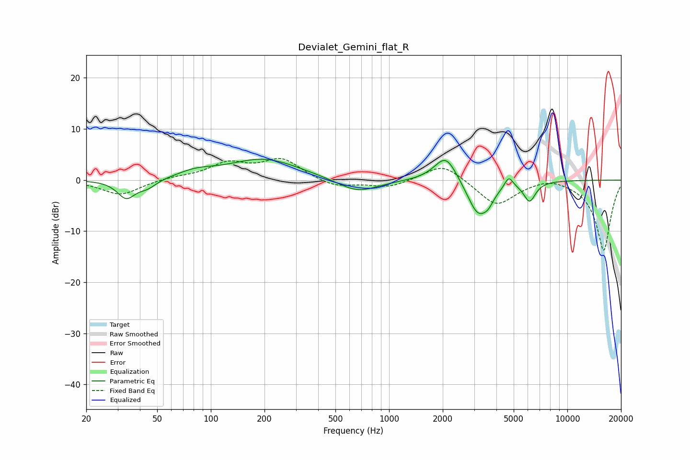

# Devialet_Gemini_flat_R
See [usage instructions](https://github.com/jaakkopasanen/AutoEq#usage) for more options and info.

### Parametric EQs
Apply preamp of -4.2 dB when using parametric equalizer.

|   # | Type    |   Fc (Hz) |    Q |   Gain (dB) |
|-----|---------|-----------|------|-------------|
|   1 | Peaking |        34 | 2.86 |        -3.5 |
|   2 | Peaking |        44 | 2.7  |        -1.5 |
|   3 | Peaking |        83 | 1.43 |         1.2 |
|   4 | Peaking |       198 | 0.7  |         4.1 |
|   5 | Peaking |       665 | 1.24 |        -2.7 |
|   6 | Peaking |      2083 | 2.17 |         5.4 |
|   7 | Peaking |      3153 | 2.28 |        -7   |
|   8 | Peaking |      3607 | 4.67 |        -1.5 |
|   9 | Peaking |      4693 | 5.98 |         2.2 |
|  10 | Peaking |      6140 | 4.18 |        -3.8 |

### Fixed Band EQs
When using fixed band (also called graphic) equalizer, apply preamp of **-4.3 dB** (if available) and set gains manually with these parameters.

|   # | Type    |   Fc (Hz) |    Q |   Gain (dB) |
|-----|---------|-----------|------|-------------|
|   1 | Peaking |        31 | 1.41 |        -2.9 |
|   2 | Peaking |        62 | 1.41 |         0.5 |
|   3 | Peaking |       125 | 1.41 |         3.1 |
|   4 | Peaking |       250 | 1.41 |         3.9 |
|   5 | Peaking |       500 | 1.41 |        -1.5 |
|   6 | Peaking |      1000 | 1.41 |        -1.5 |
|   7 | Peaking |      2000 | 1.41 |         3.4 |
|   8 | Peaking |      4000 | 1.41 |        -5   |
|   9 | Peaking |      8000 | 1.41 |         1   |
|  10 | Peaking |     16000 | 1.41 |       -13.8 |

### Graphs

