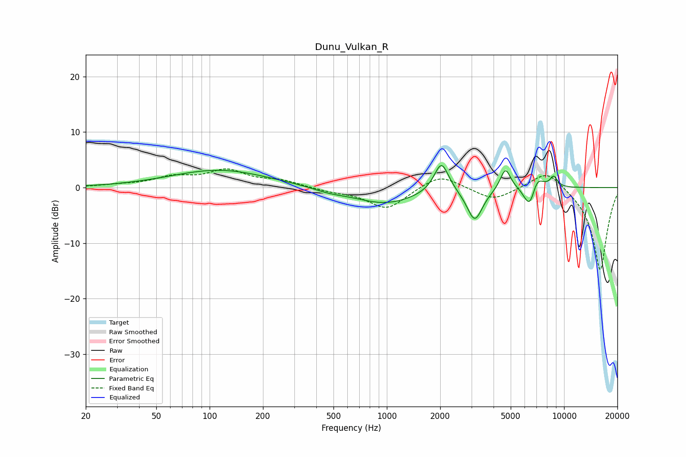

# Dunu_Vulkan_R
See [usage instructions](https://github.com/jaakkopasanen/AutoEq#usage) for more options and info.

### Parametric EQs
Apply preamp of -4.1 dB when using parametric equalizer.

|   # | Type    |   Fc (Hz) |    Q |   Gain (dB) |
|-----|---------|-----------|------|-------------|
|   1 | Peaking |       113 | 0.52 |         3.2 |
|   2 | Peaking |       473 | 1.53 |        -0.6 |
|   3 | Peaking |       978 | 0.81 |        -2.9 |
|   4 | Peaking |      2033 | 3.38 |         5.6 |
|   5 | Peaking |      3133 | 3.2  |        -5.9 |
|   6 | Peaking |      4669 | 4.76 |         3.9 |
|   7 | Peaking |      6135 | 4.6  |        -1.4 |
|   8 | Peaking |      6464 | 5.31 |        -2.8 |
|   9 | Peaking |      7046 | 3.82 |         2.3 |
|  10 | Peaking |      8743 | 6    |         1.9 |

### Fixed Band EQs
When using fixed band (also called graphic) equalizer, apply preamp of **-3.5 dB** (if available) and set gains manually with these parameters.

|   # | Type    |   Fc (Hz) |    Q |   Gain (dB) |
|-----|---------|-----------|------|-------------|
|   1 | Peaking |        31 | 1.41 |         0.4 |
|   2 | Peaking |        62 | 1.41 |         1.7 |
|   3 | Peaking |       125 | 1.41 |         2.9 |
|   4 | Peaking |       250 | 1.41 |         1.1 |
|   5 | Peaking |       500 | 1.41 |        -0.6 |
|   6 | Peaking |      1000 | 1.41 |        -3.9 |
|   7 | Peaking |      2000 | 1.41 |         2.6 |
|   8 | Peaking |      4000 | 1.41 |        -2.3 |
|   9 | Peaking |      8000 | 1.41 |         3.5 |
|  10 | Peaking |     16000 | 1.41 |       -15   |

### Graphs

