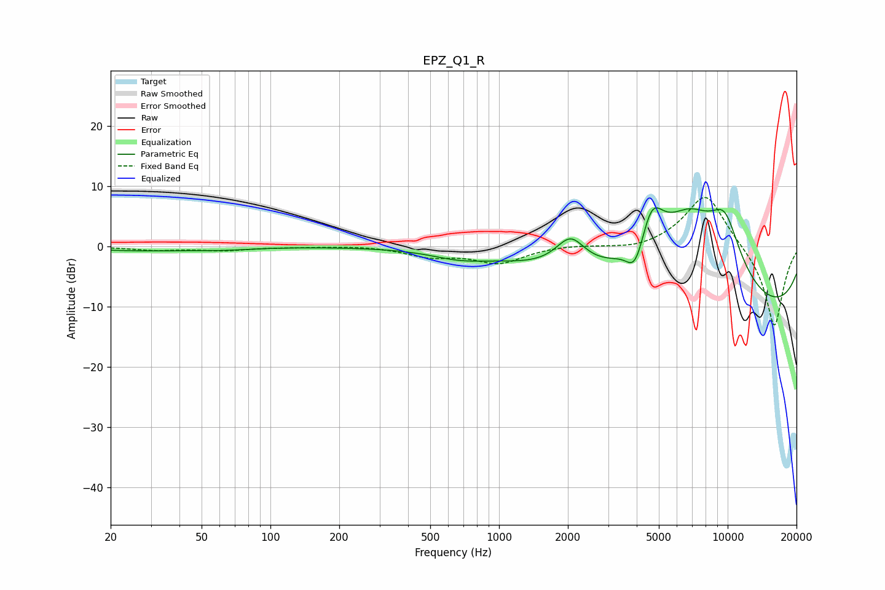

# EPZ_Q1_R
See [usage instructions](https://github.com/jaakkopasanen/AutoEq#usage) for more options and info.

### Parametric EQs
Apply preamp of -6.5 dB when using parametric equalizer.

|   # | Type    |   Fc (Hz) |    Q |   Gain (dB) |
|-----|---------|-----------|------|-------------|
|   1 | Peaking |        27 | 0.57 |        -0.7 |
|   2 | Peaking |        63 | 1.2  |        -0.3 |
|   3 | Peaking |       666 | 1.22 |        -1.1 |
|   4 | Peaking |      2053 | 2.16 |         5.1 |
|   5 | Peaking |      3864 | 4.2  |        -3.1 |
|   6 | Peaking |      4095 | 4.93 |        -1.4 |
|   7 | Peaking |      4668 | 2.64 |         7.3 |
|   8 | Peaking |      6775 | 0.71 |        16   |
|   9 | Peaking |      9574 | 0.18 |       -14.3 |
|  10 | Peaking |      9713 | 1.67 |         9.2 |

### Fixed Band EQs
When using fixed band (also called graphic) equalizer, apply preamp of **-8.2 dB** (if available) and set gains manually with these parameters.

|   # | Type    |   Fc (Hz) |    Q |   Gain (dB) |
|-----|---------|-----------|------|-------------|
|   1 | Peaking |        31 | 1.41 |        -0.6 |
|   2 | Peaking |        62 | 1.41 |        -0.6 |
|   3 | Peaking |       125 | 1.41 |        -0.1 |
|   4 | Peaking |       250 | 1.41 |         0.2 |
|   5 | Peaking |       500 | 1.41 |        -1.5 |
|   6 | Peaking |      1000 | 1.41 |        -2.7 |
|   7 | Peaking |      2000 | 1.41 |         0.3 |
|   8 | Peaking |      4000 | 1.41 |        -0.7 |
|   9 | Peaking |      8000 | 1.41 |         9.2 |
|  10 | Peaking |     16000 | 1.41 |       -13.7 |

### Graphs

