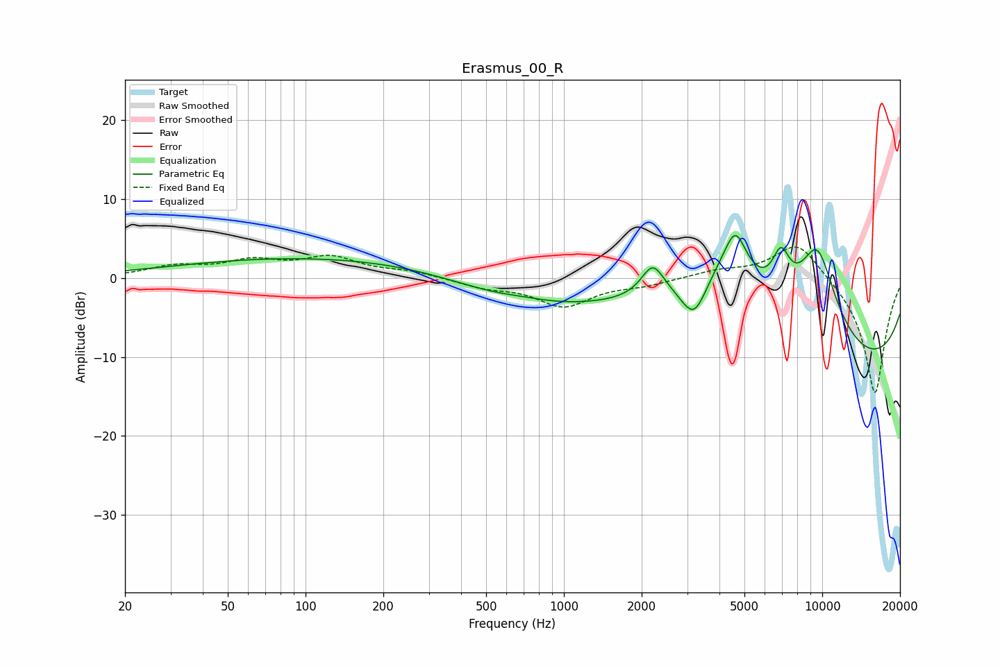

# Erasmus_00_R
See [usage instructions](https://github.com/jaakkopasanen/AutoEq#usage) for more options and info.

### Parametric EQs
Apply preamp of -5.5 dB when using parametric equalizer.

|   # | Type    |   Fc (Hz) |    Q |   Gain (dB) |
|-----|---------|-----------|------|-------------|
|   1 | Peaking |       154 | 0.19 |         2.8 |
|   2 | Peaking |       674 | 0.54 |        -4   |
|   3 | Peaking |       700 | 1.23 |         0.7 |
|   4 | Peaking |      2208 | 3.22 |         4   |
|   5 | Peaking |      3195 | 2.63 |        -5.7 |
|   6 | Peaking |      4041 | 0.71 |        10.1 |
|   7 | Peaking |      4610 | 3.25 |         5.5 |
|   8 | Peaking |      6921 | 3.94 |         4.9 |
|   9 | Peaking |      9571 | 1.43 |        13.1 |
|  10 | Peaking |     10000 | 0.18 |       -13   |

### Fixed Band EQs
When using fixed band (also called graphic) equalizer, apply preamp of **-4.0 dB** (if available) and set gains manually with these parameters.

|   # | Type    |   Fc (Hz) |    Q |   Gain (dB) |
|-----|---------|-----------|------|-------------|
|   1 | Peaking |        31 | 1.41 |         1.3 |
|   2 | Peaking |        62 | 1.41 |         1.9 |
|   3 | Peaking |       125 | 1.41 |         2.4 |
|   4 | Peaking |       250 | 1.41 |         0.7 |
|   5 | Peaking |       500 | 1.41 |        -1   |
|   6 | Peaking |      1000 | 1.41 |        -3.5 |
|   7 | Peaking |      2000 | 1.41 |        -0.8 |
|   8 | Peaking |      4000 | 1.41 |         0.9 |
|   9 | Peaking |      8000 | 1.41 |         4.8 |
|  10 | Peaking |     16000 | 1.41 |       -14.9 |

### Graphs

