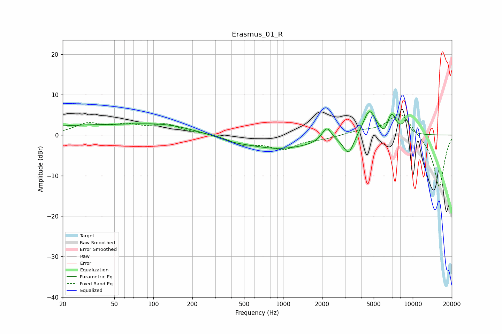

# Erasmus_01_R
See [usage instructions](https://github.com/jaakkopasanen/AutoEq#usage) for more options and info.

### Parametric EQs
Apply preamp of -5.9 dB when using parametric equalizer.

|   # | Type    |   Fc (Hz) |    Q |   Gain (dB) |
|-----|---------|-----------|------|-------------|
|   1 | Peaking |        38 | 0.21 |         2.4 |
|   2 | Peaking |       130 | 0.68 |         1.1 |
|   3 | Peaking |       410 | 1.47 |        -0.5 |
|   4 | Peaking |       936 | 0.5  |        -3.4 |
|   5 | Peaking |      2168 | 3.86 |         3.5 |
|   6 | Peaking |      3205 | 3.54 |        -4.7 |
|   7 | Peaking |      4625 | 2.82 |         6.6 |
|   8 | Peaking |      6043 | 4.25 |        -2.1 |
|   9 | Peaking |      6853 | 3.77 |         5.1 |
|  10 | Peaking |      8889 | 5.25 |         3   |

### Fixed Band EQs
When using fixed band (also called graphic) equalizer, apply preamp of **-5.2 dB** (if available) and set gains manually with these parameters.

|   # | Type    |   Fc (Hz) |    Q |   Gain (dB) |
|-----|---------|-----------|------|-------------|
|   1 | Peaking |        31 | 1.41 |         2.6 |
|   2 | Peaking |        62 | 1.41 |         2.1 |
|   3 | Peaking |       125 | 1.41 |         2.4 |
|   4 | Peaking |       250 | 1.41 |         0.4 |
|   5 | Peaking |       500 | 1.41 |        -2.2 |
|   6 | Peaking |      1000 | 1.41 |        -3.2 |
|   7 | Peaking |      2000 | 1.41 |        -0.8 |
|   8 | Peaking |      4000 | 1.41 |         0.9 |
|   9 | Peaking |      8000 | 1.41 |         5.8 |
|  10 | Peaking |     16000 | 1.41 |       -13.1 |

### Graphs

