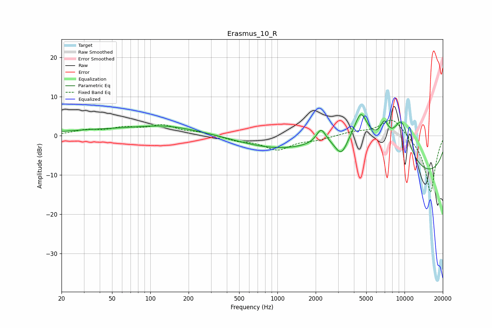

# Erasmus_10_R
See [usage instructions](https://github.com/jaakkopasanen/AutoEq#usage) for more options and info.

### Parametric EQs
Apply preamp of -5.5 dB when using parametric equalizer.

|   # | Type    |   Fc (Hz) |    Q |   Gain (dB) |
|-----|---------|-----------|------|-------------|
|   1 | Peaking |        95 | 0.18 |         1.8 |
|   2 | Peaking |       131 | 0.74 |         1   |
|   3 | Peaking |       985 | 0.4  |        -3.3 |
|   4 | Peaking |      2205 | 3.94 |         3.6 |
|   5 | Peaking |      3185 | 2.61 |        -5.6 |
|   6 | Peaking |      3951 | 0.51 |         9.6 |
|   7 | Peaking |      4540 | 2.92 |         6.4 |
|   8 | Peaking |      6930 | 3.97 |         4.6 |
|   9 | Peaking |      9467 | 1.72 |        10.8 |
|  10 | Peaking |     10000 | 0.18 |       -11.8 |

### Fixed Band EQs
When using fixed band (also called graphic) equalizer, apply preamp of **-4.1 dB** (if available) and set gains manually with these parameters.

|   # | Type    |   Fc (Hz) |    Q |   Gain (dB) |
|-----|---------|-----------|------|-------------|
|   1 | Peaking |        31 | 1.41 |         1.2 |
|   2 | Peaking |        62 | 1.41 |         1.7 |
|   3 | Peaking |       125 | 1.41 |         2.4 |
|   4 | Peaking |       250 | 1.41 |         0.7 |
|   5 | Peaking |       500 | 1.41 |        -1.1 |
|   6 | Peaking |      1000 | 1.41 |        -3.4 |
|   7 | Peaking |      2000 | 1.41 |        -0.9 |
|   8 | Peaking |      4000 | 1.41 |         0.9 |
|   9 | Peaking |      8000 | 1.41 |         4.9 |
|  10 | Peaking |     16000 | 1.41 |       -14.6 |

### Graphs

