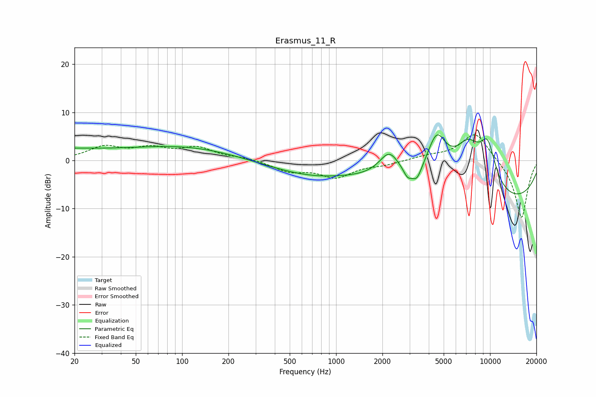

# Erasmus_11_R
See [usage instructions](https://github.com/jaakkopasanen/AutoEq#usage) for more options and info.

### Parametric EQs
Apply preamp of -5.4 dB when using parametric equalizer.

|   # | Type    |   Fc (Hz) |    Q |   Gain (dB) |
|-----|---------|-----------|------|-------------|
|   1 | Peaking |        34 | 0.41 |        -2.1 |
|   2 | Peaking |        41 | 0.2  |         4.7 |
|   3 | Peaking |       693 | 0.49 |        -2.9 |
|   4 | Peaking |      2216 | 2.13 |         5.2 |
|   5 | Peaking |      2915 | 5.4  |        -1.8 |
|   6 | Peaking |      3348 | 4.43 |        -2.8 |
|   7 | Peaking |      4505 | 2.09 |         9.3 |
|   8 | Peaking |      7192 | 1.31 |         9.8 |
|   9 | Peaking |      9657 | 2.31 |         8.4 |
|  10 | Peaking |     10000 | 0.22 |        -9.5 |

### Fixed Band EQs
When using fixed band (also called graphic) equalizer, apply preamp of **-5.4 dB** (if available) and set gains manually with these parameters.

|   # | Type    |   Fc (Hz) |    Q |   Gain (dB) |
|-----|---------|-----------|------|-------------|
|   1 | Peaking |        31 | 1.41 |         2.6 |
|   2 | Peaking |        62 | 1.41 |         2.2 |
|   3 | Peaking |       125 | 1.41 |         2.4 |
|   4 | Peaking |       250 | 1.41 |         0.5 |
|   5 | Peaking |       500 | 1.41 |        -2.1 |
|   6 | Peaking |      1000 | 1.41 |        -3.3 |
|   7 | Peaking |      2000 | 1.41 |        -0.7 |
|   8 | Peaking |      4000 | 1.41 |         0.8 |
|   9 | Peaking |      8000 | 1.41 |         6   |
|  10 | Peaking |     16000 | 1.41 |       -12.2 |

### Graphs

