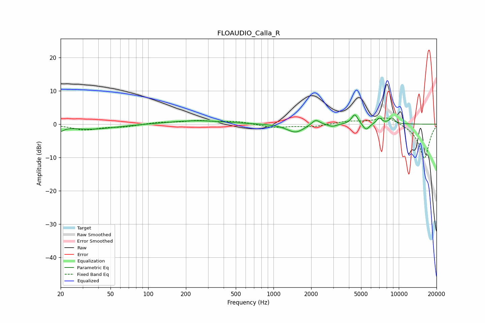

# FLOAUDIO_Calla_R
See [usage instructions](https://github.com/jaakkopasanen/AutoEq#usage) for more options and info.

### Parametric EQs
Apply preamp of -2.9 dB when using parametric equalizer.

|   # | Type    |   Fc (Hz) |    Q |   Gain (dB) |
|-----|---------|-----------|------|-------------|
|   1 | Peaking |        20 | 5.91 |        -1.3 |
|   2 | Peaking |        35 | 0.72 |        -1.5 |
|   3 | Peaking |       241 | 0.64 |         1.1 |
|   4 | Peaking |      1497 | 2.07 |        -2.5 |
|   5 | Peaking |      2170 | 4.36 |         1.8 |
|   6 | Peaking |      2954 | 4.59 |        -0.7 |
|   7 | Peaking |      4457 | 5.49 |         3.1 |
|   8 | Peaking |      5485 | 5.48 |        -2   |
|   9 | Peaking |      6979 | 6    |         1.8 |
|  10 | Peaking |      8831 | 5.53 |         1.8 |

### Fixed Band EQs
When using fixed band (also called graphic) equalizer, apply preamp of **-2.0 dB** (if available) and set gains manually with these parameters.

|   # | Type    |   Fc (Hz) |    Q |   Gain (dB) |
|-----|---------|-----------|------|-------------|
|   1 | Peaking |        31 | 1.41 |        -1.7 |
|   2 | Peaking |        62 | 1.41 |        -0.7 |
|   3 | Peaking |       125 | 1.41 |         0.5 |
|   4 | Peaking |       250 | 1.41 |         0.9 |
|   5 | Peaking |       500 | 1.41 |         0.8 |
|   6 | Peaking |      1000 | 1.41 |        -1   |
|   7 | Peaking |      2000 | 1.41 |        -0.8 |
|   8 | Peaking |      4000 | 1.41 |         0.8 |
|   9 | Peaking |      8000 | 1.41 |         2.3 |
|  10 | Peaking |     16000 | 1.41 |       -10.4 |

### Graphs

