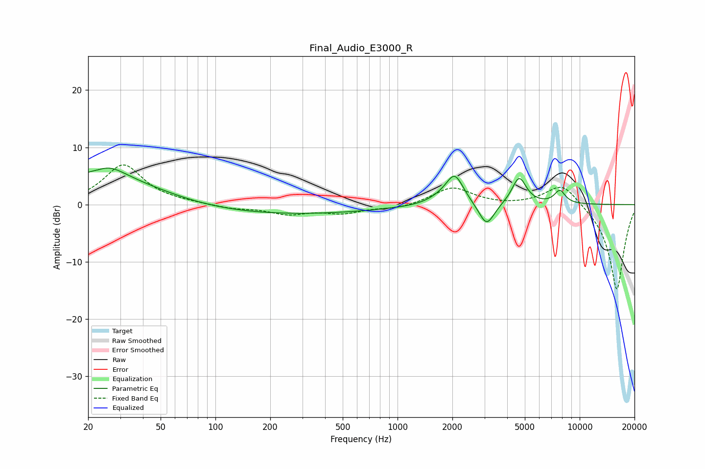

# Final_Audio_E3000_R
See [usage instructions](https://github.com/jaakkopasanen/AutoEq#usage) for more options and info.

### Parametric EQs
Apply preamp of -6.5 dB when using parametric equalizer.

|   # | Type    |   Fc (Hz) |    Q |   Gain (dB) |
|-----|---------|-----------|------|-------------|
|   1 | Peaking |        20 | 5.97 |         3.3 |
|   2 | Peaking |        20 | 5.98 |        -3   |
|   3 | Peaking |        26 | 1.7  |         1.9 |
|   4 | Peaking |        26 | 0.45 |         5   |
|   5 | Peaking |       183 | 0.22 |        -1.8 |
|   6 | Peaking |      1708 | 2.05 |         0.8 |
|   7 | Peaking |      2061 | 2.9  |         5.1 |
|   8 | Peaking |      3083 | 3.32 |        -4.2 |
|   9 | Peaking |      4652 | 3.56 |         4.8 |
|  10 | Peaking |      7779 | 4.36 |         2.3 |

### Fixed Band EQs
When using fixed band (also called graphic) equalizer, apply preamp of **-7.0 dB** (if available) and set gains manually with these parameters.

|   # | Type    |   Fc (Hz) |    Q |   Gain (dB) |
|-----|---------|-----------|------|-------------|
|   1 | Peaking |        31 | 1.41 |         6.9 |
|   2 | Peaking |        62 | 1.41 |         0.2 |
|   3 | Peaking |       125 | 1.41 |        -0.7 |
|   4 | Peaking |       250 | 1.41 |        -1.5 |
|   5 | Peaking |       500 | 1.41 |        -1.3 |
|   6 | Peaking |      1000 | 1.41 |        -0.7 |
|   7 | Peaking |      2000 | 1.41 |         3   |
|   8 | Peaking |      4000 | 1.41 |        -0.2 |
|   9 | Peaking |      8000 | 1.41 |         4   |
|  10 | Peaking |     16000 | 1.41 |       -15.1 |

### Graphs

