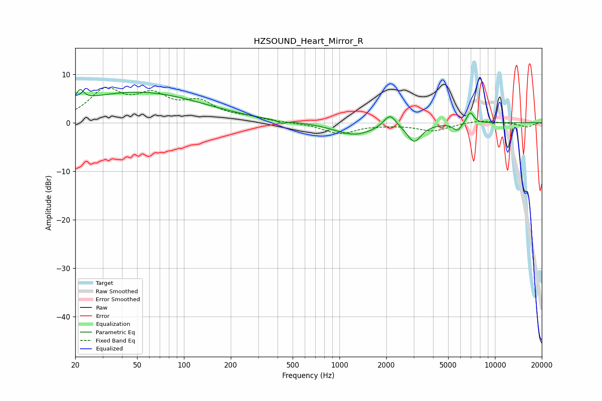

# HZSOUND_Heart_Mirror_R
See [usage instructions](https://github.com/jaakkopasanen/AutoEq#usage) for more options and info.

### Parametric EQs
Apply preamp of -6.9 dB when using parametric equalizer.

|   # | Type    |   Fc (Hz) |    Q |   Gain (dB) |
|-----|---------|-----------|------|-------------|
|   1 | Peaking |        21 | 6    |         2.3 |
|   2 | Peaking |        34 | 0.26 |         1   |
|   3 | Peaking |        52 | 0.34 |         5.3 |
|   4 | Peaking |       426 | 5.94 |        -0.6 |
|   5 | Peaking |      1249 | 1.11 |        -2.5 |
|   6 | Peaking |      2111 | 3.61 |         2.8 |
|   7 | Peaking |      3025 | 3.12 |        -3.8 |
|   8 | Peaking |      5737 | 5.19 |        -1.6 |
|   9 | Peaking |      6875 | 6    |         0.6 |
|  10 | Peaking |      6938 | 5.99 |         1.8 |

### Fixed Band EQs
When using fixed band (also called graphic) equalizer, apply preamp of **-7.4 dB** (if available) and set gains manually with these parameters.

|   # | Type    |   Fc (Hz) |    Q |   Gain (dB) |
|-----|---------|-----------|------|-------------|
|   1 | Peaking |        31 | 1.41 |         6.2 |
|   2 | Peaking |        62 | 1.41 |         4.7 |
|   3 | Peaking |       125 | 1.41 |         3.7 |
|   4 | Peaking |       250 | 1.41 |         0.8 |
|   5 | Peaking |       500 | 1.41 |        -0   |
|   6 | Peaking |      1000 | 1.41 |        -2.2 |
|   7 | Peaking |      2000 | 1.41 |        -0.3 |
|   8 | Peaking |      4000 | 1.41 |        -1.7 |
|   9 | Peaking |      8000 | 1.41 |         0.6 |
|  10 | Peaking |     16000 | 1.41 |        -0.9 |

### Graphs

