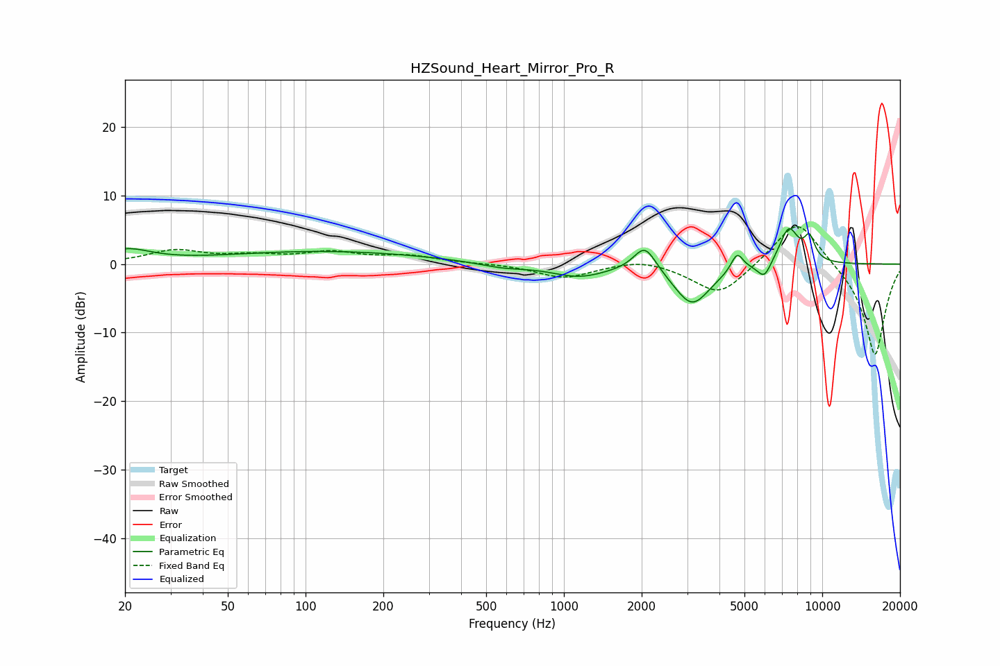

# HZSound_Heart_Mirror_Pro_R
See [usage instructions](https://github.com/jaakkopasanen/AutoEq#usage) for more options and info.

### Parametric EQs
Apply preamp of -5.3 dB when using parametric equalizer.

|   # | Type    |   Fc (Hz) |    Q |   Gain (dB) |
|-----|---------|-----------|------|-------------|
|   1 | Peaking |        20 | 1.55 |         1.9 |
|   2 | Peaking |       120 | 0.35 |         1.8 |
|   3 | Peaking |       576 | 1.52 |        -0.7 |
|   4 | Peaking |      1141 | 1.32 |        -1.8 |
|   5 | Peaking |      2059 | 3.25 |         3.9 |
|   6 | Peaking |      3137 | 1.98 |        -6   |
|   7 | Peaking |      4683 | 5.96 |         2.7 |
|   8 | Peaking |      5967 | 5.23 |        -2.4 |
|   9 | Peaking |      7421 | 3.64 |         5.3 |
|  10 | Peaking |      8924 | 5.94 |         3.3 |

### Fixed Band EQs
When using fixed band (also called graphic) equalizer, apply preamp of **-5.5 dB** (if available) and set gains manually with these parameters.

|   # | Type    |   Fc (Hz) |    Q |   Gain (dB) |
|-----|---------|-----------|------|-------------|
|   1 | Peaking |        31 | 1.41 |         1.9 |
|   2 | Peaking |        62 | 1.41 |         1   |
|   3 | Peaking |       125 | 1.41 |         1.5 |
|   4 | Peaking |       250 | 1.41 |         1.1 |
|   5 | Peaking |       500 | 1.41 |         0.1 |
|   6 | Peaking |      1000 | 1.41 |        -2   |
|   7 | Peaking |      2000 | 1.41 |         0.9 |
|   8 | Peaking |      4000 | 1.41 |        -4.7 |
|   9 | Peaking |      8000 | 1.41 |         7.1 |
|  10 | Peaking |     16000 | 1.41 |       -13.6 |

### Graphs

