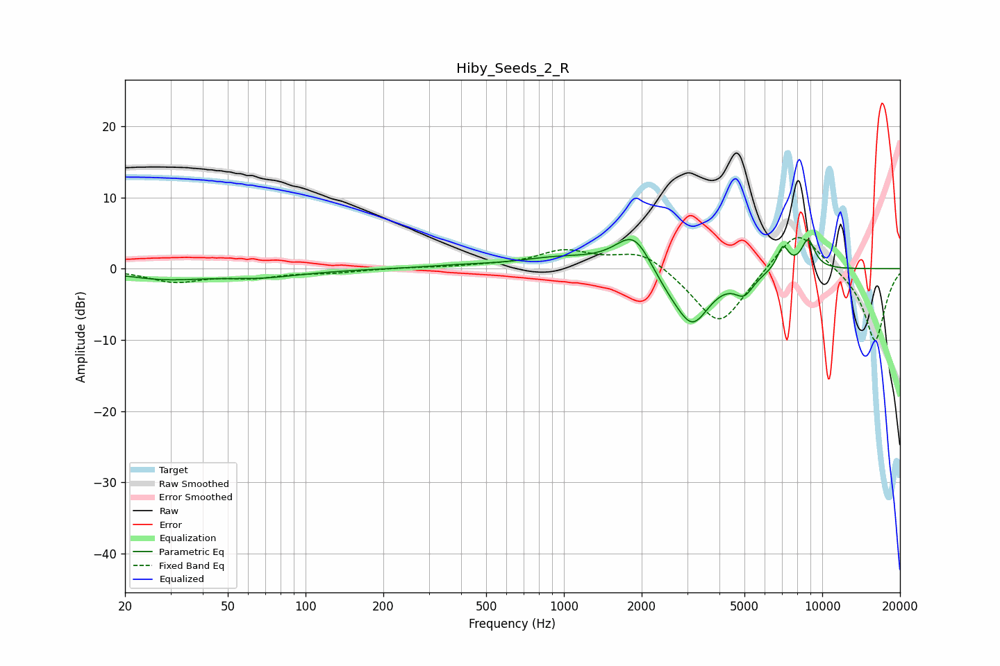

# Hiby_Seeds_2_R
See [usage instructions](https://github.com/jaakkopasanen/AutoEq#usage) for more options and info.

### Parametric EQs
Apply preamp of -4.2 dB when using parametric equalizer.

|   # | Type    |   Fc (Hz) |    Q |   Gain (dB) |
|-----|---------|-----------|------|-------------|
|   1 | Peaking |        28 | 0.92 |        -1.3 |
|   2 | Peaking |        67 | 0.85 |        -1.1 |
|   3 | Peaking |       390 | 1.11 |         0.3 |
|   4 | Peaking |       964 | 0.87 |         1.4 |
|   5 | Peaking |      1870 | 1.97 |         5.5 |
|   6 | Peaking |      2516 | 1.88 |        -1.8 |
|   7 | Peaking |      3144 | 2.01 |        -7.5 |
|   8 | Peaking |      4987 | 3.74 |        -2.6 |
|   9 | Peaking |      7047 | 5.87 |         3.3 |
|  10 | Peaking |      8813 | 4.76 |         4.1 |

### Fixed Band EQs
When using fixed band (also called graphic) equalizer, apply preamp of **-4.5 dB** (if available) and set gains manually with these parameters.

|   # | Type    |   Fc (Hz) |    Q |   Gain (dB) |
|-----|---------|-----------|------|-------------|
|   1 | Peaking |        31 | 1.41 |        -1.7 |
|   2 | Peaking |        62 | 1.41 |        -1.1 |
|   3 | Peaking |       125 | 1.41 |        -0.5 |
|   4 | Peaking |       250 | 1.41 |         0.1 |
|   5 | Peaking |       500 | 1.41 |         0.3 |
|   6 | Peaking |      1000 | 1.41 |         2.4 |
|   7 | Peaking |      2000 | 1.41 |         2.7 |
|   8 | Peaking |      4000 | 1.41 |        -8.4 |
|   9 | Peaking |      8000 | 1.41 |         6.2 |
|  10 | Peaking |     16000 | 1.41 |       -10.3 |

### Graphs

